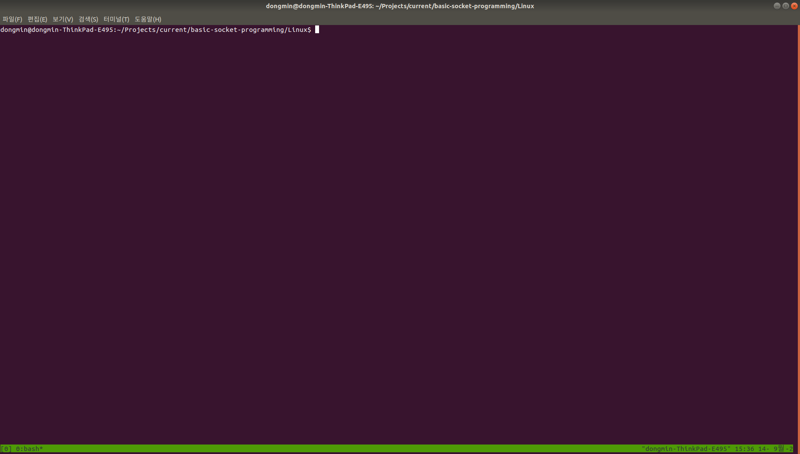
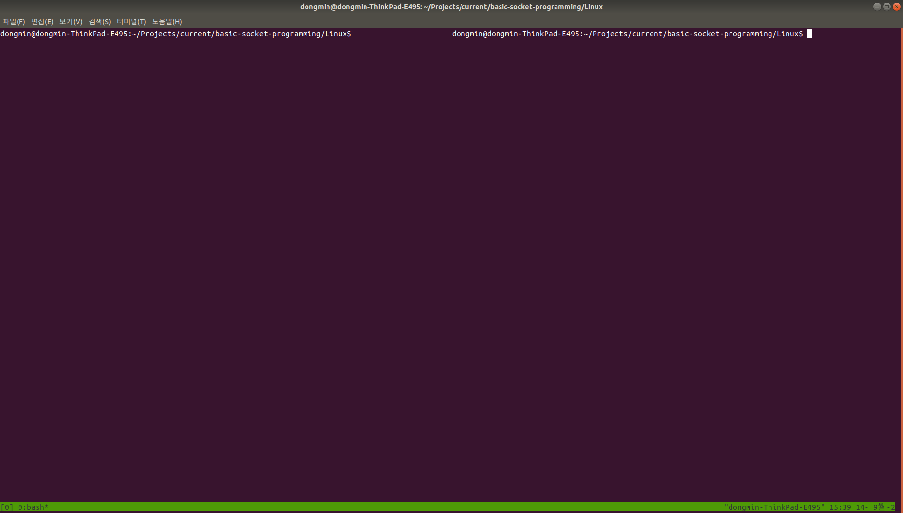
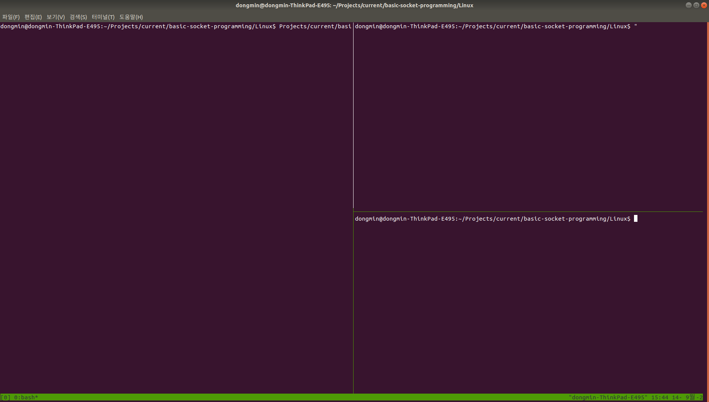

Do you want to deal with multiple terminals at once?
Here's something that I need for Tmux editor.

### Install

```
$ sudo apt install tmux
```

### Start

```
$ tmux
```



### Trigger Key
for tmux env, `<CTRL-B>` is trigger 

### Vertical Split
```
$ <CTRL-B> %
```



### Horizontal Split
```
$ <CTRL-B> "
```



### Move across panes
```
$ <CTRL-B> <arrow key>
```

### Create another window
```
$ <CTRL-B> c
```

### Move to another window
```
$ <CTRL-B> <window name>
```

for example, 
```
$ <CTRL-B> 0
```

### Detach the session
```
$ <CTRL-B> d
```

### Check tmux status
```
$ tmux ls
```

### Return to session
```
$ tmux attach
```

### Kill session
```
$ tmux kill-session -t 0
```