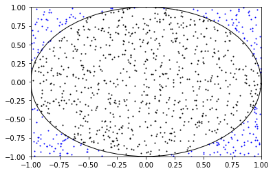
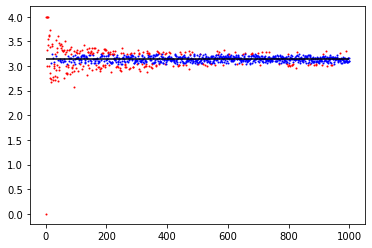

*Monte Carlo Process to estimate 𝜋 with visualization*

The task is to compute an approximation to 𝜋 using [Monte Carlo][monte-carlo].

-Version 1
First we draw unit circle, which is $$ x^2 + y^2 = 1 $$ 
to the coordinate and plot the dots.


​```python
	import numpy as np
	import matplotlib.pyplot as plt
```

The result comes out as:



let's setup the initial variables.

```python
	trial = 1000
	inCircle = 0
```

And draw the unit circle to the plt.

```python
	circle = plt.Circle((0, 0), radius = 1, color='black', fill=False)
	ax = plt.gca()
	ax.add_artist(circle)
```

And then, plot the random coordinate.
```python
	for i in range(trial):
		x = np.random.uniform(-1,1)
    y = np.random.uniform(-1,1)
    
    	if (x**2 + y**2 < 1):
        	inCircle += 1
        	plt.scatter(x, y, s = 1, color = "black")
    	else:
        	plt.scatter(x, y, s = 1, color = "blue")   
```

Show the canvas and calculate the answer.        
```python
	plt.axis([-1, 1, -1, 1])
	plt.show()
	ratio = inCircle/trial
	π = ratio * 4
	print(π)
​```


## Version 2
We want to see the converging process. 

'''python
	import numpy as np
	import matplotlib.pyplot as plt
	import math

	def monteCarloPi(trial):
 		cnt = 0
    
  	for i in range(trial):
   		x = np.random.uniform(-1,1)
   	  y = np.random.uniform(-1,1)
        
   	  if (x**2 + y**2 < 1):
   	  	cnt = cnt+1
    
   	return (cnt/trial)*4

	def plotApproxProcess(x, ϵ, trial):
		plt.hlines(π, 1, trial, colors='black', linestyles='solid', label='π')
    for i in range(1, trial+1):
    	result = monteCarloPi(i)
      if abs(result - x) < ϵ:
      	plt.scatter(i, result, s = 1, color = "blue")
      else:
      	plt.scatter(i, result, s = 1, color = "red")
    
	π = math.pi
	ϵ = 0.1
	plotApproxProcess(π, ϵ, 1000)
	plt.show()
'''

The result comes out as:



[monte-carlo]: https://en.wikipedia.org/wiki/Monte_Carlo_method

