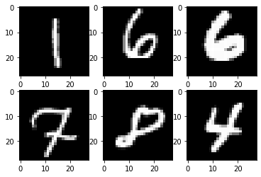
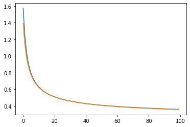
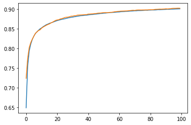
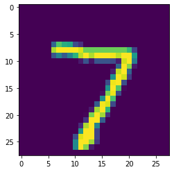

MNIST is the starting point of Computer Vision Research. Let’s try them with Keras. 

In here, We are going to setup linear-dummy-model for MNIST classification.

## Setups

what we need is tensorflow, keras mainly, and a bit of other libraries.


```python
import tensorflow as tf
from tensorflow import keras
import numpy as np
from sklearn.model_selection import train_test_split
import matplotlib.pyplot as plt
```

Check if gpu is available here. Are we good?


```python
device_name = tf.test.gpu_device_name()
if device_name != '/device:GPU:0':
  raise SystemError('GPU device not found')
print('Found GPU at: {}'.format(device_name))
```

```text
Found GPU at: /device:GPU:0

```

## Load Data, and EDA

Load data from keras, and check them.

Here, we are going to split the dataset into 3.

- Train: Textbook. our model works on this data again and again, in order to see the pattern.
- Validation: Mock Exam. Test paper is kept secret. However, we need to know if our model works good on unseen data. So we split training data, and assign validation dataset for that purpose.
- Test: Exam. This dataset should be kept secret. If not - we may unconsciously apply our knowledge on unseen data, which might result in failure of generalization.


```python
(x_train, y_train), (x_test, y_test) = keras.datasets.mnist.load_data()
```

```text
Downloading data from https://storage.googleapis.com/tensorflow/tf-keras-datasets/mnist.npz
11493376/11490434 [==============================] - 0s 0us/step

```


```python
x_train, x_val, y_train, y_val = train_test_split(x_train, y_train, test_size = 0.1, random_state = 42)
```


```python
x_train.shape, y_train.shape
```


```text
((54000, 28, 28), (54000,))
```


```python
x_val.shape, y_val.shape
```


```text
((6000, 28, 28), (6000,))
```


```python
x_test.shape, y_test.shape
```


```text
((10000, 28, 28), (10000,))
```


preprocess here. 
- For image data: divide by 255.0 so that the pixel values range from 0 to 1.
- For label data: make it to_categorical(may not be neccessary, but I'll do it.)


```python
x_train, x_val, x_test = x_train / 255.0, x_val / 255.0, x_test / 255.0
```


```python
y_train, y_val, y_test = tf.keras.utils.to_categorical(y_train), tf.keras.utils.to_categorical(y_val), tf.keras.utils.to_categorical(y_test)
```


```python
y_train[0]
```


```text
array([0., 1., 0., 0., 0., 0., 0., 0., 0., 0.], dtype=float32)
```


```python
for i in range(6):
    plt.subplot(2, 3, i+1)
    plt.imshow(x_train[i], cmap = "gray")
plt.show()
```





## Models

Let's set up some hyperparameters.

**BATCH_SIZE** will determine the number of data that will be into the model.

**EPOCHS** will be the number of iterations through the whole dataset.


```python
BATCH_SIZE = 64
EPOCHS = 100
```

**Loss** function plays the role of penalty for the model.

If models does great on its job(classifying the digit well enough), penalty will go lower and lower.

Our function would be categorical crossentropy.

$ \Sigma_{i=1}^{C}t_ilog(s_i) $ 

Our objective is to minimize that loss.


```python
loss = keras.losses.CategoricalCrossentropy()
```

**Metric** is the criteria for the model performance.


```python
metrics = ["accuracy"]
```

**Optimizer** will decide how the model is being optimized. 


```python
optimizer = keras.optimizers.SGD(learning_rate = 1e-03)
```

### Linear Model

Firstly, let's try linear models.

we may try something like:

$ pixel1 * a1 + ... + pixel784 * a784 + bias $

Our input is 28 X 28 image data.

So, we need to flatten that data into 1d array, in order to feed that as an input.


```python
linear_model = keras.models.Sequential([
    keras.layers.Flatten(input_shape = (28, 28)),
    keras.layers.Dense(10, activation="softmax")
])
```


```python
linear_model.summary()
```

```text
Model: "sequential"
_________________________________________________________________
Layer (type)                 Output Shape              Param #   
=================================================================
flatten (Flatten)            (None, 784)               0         
_________________________________________________________________
dense (Dense)                (None, 10)                7850      
=================================================================
Total params: 7,850
Trainable params: 7,850
Non-trainable params: 0
_________________________________________________________________

```

Additionally, callback functions will be listed. 

checkpoint callback will save the best model as a file.


```python
ckpt = tf.keras.callbacks.ModelCheckpoint(
    filepath="./best.ckpt",
    save_weights_only=True,
    monitor='val_accuracy',
    mode='max',
    save_best_only=True)
```


```python
linear_model.compile(loss = loss, optimizer = optimizer, metrics = metrics)
```

## Model Training

Let's train our model here!


```python
with tf.device(device_name = device_name):
    linear_model_history = linear_model.fit(x_train, y_train, batch_size = BATCH_SIZE, epochs = EPOCHS, callbacks = [ckpt], shuffle = True, verbose = 2, validation_data=(x_val, y_val))
```

```text
Epoch 1/100
844/844 - 2s - loss: 1.5725 - accuracy: 0.6494 - val_loss: 1.3902 - val_accuracy: 0.7243
Epoch 2/100
844/844 - 2s - loss: 1.2511 - accuracy: 0.7552 - val_loss: 1.1497 - val_accuracy: 0.7752
Epoch 3/100
844/844 - 2s - loss: 1.0616 - accuracy: 0.7939 - val_loss: 1.0000 - val_accuracy: 0.8027
Epoch 4/100
844/844 - 2s - loss: 0.9395 - accuracy: 0.8115 - val_loss: 0.8992 - val_accuracy: 0.8153
Epoch 5/100
844/844 - 2s - loss: 0.8547 - accuracy: 0.8233 - val_loss: 0.8269 - val_accuracy: 0.8242
Epoch 6/100
844/844 - 2s - loss: 0.7924 - accuracy: 0.8318 - val_loss: 0.7720 - val_accuracy: 0.8315
Epoch 7/100
844/844 - 2s - loss: 0.7445 - accuracy: 0.8381 - val_loss: 0.7293 - val_accuracy: 0.8390
Epoch 8/100
844/844 - 2s - loss: 0.7065 - accuracy: 0.8428 - val_loss: 0.6947 - val_accuracy: 0.8422
Epoch 9/100
844/844 - 2s - loss: 0.6755 - accuracy: 0.8467 - val_loss: 0.6661 - val_accuracy: 0.8460
Epoch 10/100
844/844 - 2s - loss: 0.6496 - accuracy: 0.8503 - val_loss: 0.6421 - val_accuracy: 0.8477
Epoch 11/100
844/844 - 2s - loss: 0.6277 - accuracy: 0.8527 - val_loss: 0.6214 - val_accuracy: 0.8520
Epoch 12/100
844/844 - 2s - loss: 0.6088 - accuracy: 0.8558 - val_loss: 0.6037 - val_accuracy: 0.8547
Epoch 13/100
844/844 - 2s - loss: 0.5924 - accuracy: 0.8582 - val_loss: 0.5879 - val_accuracy: 0.8570
Epoch 14/100
844/844 - 2s - loss: 0.5779 - accuracy: 0.8607 - val_loss: 0.5740 - val_accuracy: 0.8592
Epoch 15/100
844/844 - 2s - loss: 0.5650 - accuracy: 0.8622 - val_loss: 0.5616 - val_accuracy: 0.8612
Epoch 16/100
844/844 - 2s - loss: 0.5534 - accuracy: 0.8642 - val_loss: 0.5503 - val_accuracy: 0.8627
Epoch 17/100
844/844 - 2s - loss: 0.5430 - accuracy: 0.8654 - val_loss: 0.5402 - val_accuracy: 0.8652
Epoch 18/100
844/844 - 2s - loss: 0.5336 - accuracy: 0.8667 - val_loss: 0.5310 - val_accuracy: 0.8672
Epoch 19/100
844/844 - 2s - loss: 0.5249 - accuracy: 0.8683 - val_loss: 0.5225 - val_accuracy: 0.8695
Epoch 20/100
844/844 - 2s - loss: 0.5170 - accuracy: 0.8697 - val_loss: 0.5147 - val_accuracy: 0.8717
Epoch 21/100
844/844 - 2s - loss: 0.5097 - accuracy: 0.8711 - val_loss: 0.5075 - val_accuracy: 0.8728
Epoch 22/100
844/844 - 2s - loss: 0.5029 - accuracy: 0.8722 - val_loss: 0.5008 - val_accuracy: 0.8733
Epoch 23/100
844/844 - 2s - loss: 0.4967 - accuracy: 0.8732 - val_loss: 0.4947 - val_accuracy: 0.8753
Epoch 24/100
844/844 - 2s - loss: 0.4908 - accuracy: 0.8744 - val_loss: 0.4889 - val_accuracy: 0.8762
Epoch 25/100
844/844 - 2s - loss: 0.4853 - accuracy: 0.8751 - val_loss: 0.4834 - val_accuracy: 0.8775
Epoch 26/100
844/844 - 2s - loss: 0.4802 - accuracy: 0.8758 - val_loss: 0.4784 - val_accuracy: 0.8792
Epoch 27/100
844/844 - 2s - loss: 0.4754 - accuracy: 0.8769 - val_loss: 0.4735 - val_accuracy: 0.8797
Epoch 28/100
844/844 - 2s - loss: 0.4709 - accuracy: 0.8780 - val_loss: 0.4690 - val_accuracy: 0.8800
Epoch 29/100
844/844 - 2s - loss: 0.4666 - accuracy: 0.8786 - val_loss: 0.4647 - val_accuracy: 0.8812
Epoch 30/100
844/844 - 2s - loss: 0.4625 - accuracy: 0.8795 - val_loss: 0.4606 - val_accuracy: 0.8823
Epoch 31/100
844/844 - 2s - loss: 0.4587 - accuracy: 0.8800 - val_loss: 0.4567 - val_accuracy: 0.8825
Epoch 32/100
844/844 - 2s - loss: 0.4550 - accuracy: 0.8808 - val_loss: 0.4531 - val_accuracy: 0.8835
Epoch 33/100
844/844 - 2s - loss: 0.4516 - accuracy: 0.8815 - val_loss: 0.4497 - val_accuracy: 0.8837
Epoch 34/100
844/844 - 2s - loss: 0.4483 - accuracy: 0.8821 - val_loss: 0.4463 - val_accuracy: 0.8850
Epoch 35/100
844/844 - 2s - loss: 0.4451 - accuracy: 0.8828 - val_loss: 0.4432 - val_accuracy: 0.8853
Epoch 36/100
844/844 - 2s - loss: 0.4421 - accuracy: 0.8834 - val_loss: 0.4401 - val_accuracy: 0.8855
Epoch 37/100
844/844 - 2s - loss: 0.4392 - accuracy: 0.8839 - val_loss: 0.4372 - val_accuracy: 0.8857
Epoch 38/100
844/844 - 2s - loss: 0.4364 - accuracy: 0.8843 - val_loss: 0.4345 - val_accuracy: 0.8860
Epoch 39/100
844/844 - 2s - loss: 0.4338 - accuracy: 0.8847 - val_loss: 0.4318 - val_accuracy: 0.8863
Epoch 40/100
844/844 - 2s - loss: 0.4313 - accuracy: 0.8849 - val_loss: 0.4292 - val_accuracy: 0.8865
Epoch 41/100
844/844 - 2s - loss: 0.4288 - accuracy: 0.8856 - val_loss: 0.4267 - val_accuracy: 0.8877
Epoch 42/100
844/844 - 2s - loss: 0.4265 - accuracy: 0.8861 - val_loss: 0.4244 - val_accuracy: 0.8878
Epoch 43/100
844/844 - 2s - loss: 0.4242 - accuracy: 0.8865 - val_loss: 0.4220 - val_accuracy: 0.8882
Epoch 44/100
844/844 - 2s - loss: 0.4220 - accuracy: 0.8868 - val_loss: 0.4198 - val_accuracy: 0.8883
Epoch 45/100
844/844 - 2s - loss: 0.4199 - accuracy: 0.8874 - val_loss: 0.4177 - val_accuracy: 0.8890
Epoch 46/100
844/844 - 2s - loss: 0.4178 - accuracy: 0.8877 - val_loss: 0.4156 - val_accuracy: 0.8892
Epoch 47/100
844/844 - 2s - loss: 0.4159 - accuracy: 0.8882 - val_loss: 0.4137 - val_accuracy: 0.8898
Epoch 48/100
844/844 - 2s - loss: 0.4140 - accuracy: 0.8885 - val_loss: 0.4117 - val_accuracy: 0.8903
Epoch 49/100
844/844 - 2s - loss: 0.4121 - accuracy: 0.8893 - val_loss: 0.4098 - val_accuracy: 0.8903
Epoch 50/100
844/844 - 2s - loss: 0.4103 - accuracy: 0.8894 - val_loss: 0.4081 - val_accuracy: 0.8910
Epoch 51/100
844/844 - 2s - loss: 0.4086 - accuracy: 0.8900 - val_loss: 0.4063 - val_accuracy: 0.8913
Epoch 52/100
844/844 - 2s - loss: 0.4069 - accuracy: 0.8902 - val_loss: 0.4046 - val_accuracy: 0.8915
Epoch 53/100
844/844 - 2s - loss: 0.4053 - accuracy: 0.8907 - val_loss: 0.4029 - val_accuracy: 0.8913
Epoch 54/100
844/844 - 2s - loss: 0.4037 - accuracy: 0.8910 - val_loss: 0.4013 - val_accuracy: 0.8915
Epoch 55/100
844/844 - 2s - loss: 0.4022 - accuracy: 0.8914 - val_loss: 0.3998 - val_accuracy: 0.8920
Epoch 56/100
844/844 - 2s - loss: 0.4007 - accuracy: 0.8916 - val_loss: 0.3982 - val_accuracy: 0.8922
Epoch 57/100
844/844 - 2s - loss: 0.3992 - accuracy: 0.8919 - val_loss: 0.3968 - val_accuracy: 0.8928
Epoch 58/100
844/844 - 2s - loss: 0.3978 - accuracy: 0.8921 - val_loss: 0.3953 - val_accuracy: 0.8937
Epoch 59/100
844/844 - 2s - loss: 0.3964 - accuracy: 0.8926 - val_loss: 0.3939 - val_accuracy: 0.8940
Epoch 60/100
844/844 - 2s - loss: 0.3951 - accuracy: 0.8929 - val_loss: 0.3926 - val_accuracy: 0.8945
Epoch 61/100
844/844 - 2s - loss: 0.3938 - accuracy: 0.8931 - val_loss: 0.3912 - val_accuracy: 0.8947
Epoch 62/100
844/844 - 2s - loss: 0.3925 - accuracy: 0.8937 - val_loss: 0.3900 - val_accuracy: 0.8952
Epoch 63/100
844/844 - 2s - loss: 0.3912 - accuracy: 0.8939 - val_loss: 0.3887 - val_accuracy: 0.8953
Epoch 64/100
844/844 - 2s - loss: 0.3900 - accuracy: 0.8941 - val_loss: 0.3874 - val_accuracy: 0.8955
Epoch 65/100
844/844 - 2s - loss: 0.3888 - accuracy: 0.8945 - val_loss: 0.3863 - val_accuracy: 0.8957
Epoch 66/100
844/844 - 2s - loss: 0.3877 - accuracy: 0.8946 - val_loss: 0.3851 - val_accuracy: 0.8958
Epoch 67/100
844/844 - 2s - loss: 0.3865 - accuracy: 0.8949 - val_loss: 0.3839 - val_accuracy: 0.8963
Epoch 68/100
844/844 - 2s - loss: 0.3854 - accuracy: 0.8953 - val_loss: 0.3828 - val_accuracy: 0.8967
Epoch 69/100
844/844 - 2s - loss: 0.3844 - accuracy: 0.8955 - val_loss: 0.3817 - val_accuracy: 0.8972
Epoch 70/100
844/844 - 2s - loss: 0.3833 - accuracy: 0.8958 - val_loss: 0.3807 - val_accuracy: 0.8973
Epoch 71/100
844/844 - 2s - loss: 0.3823 - accuracy: 0.8960 - val_loss: 0.3796 - val_accuracy: 0.8970
Epoch 72/100
844/844 - 2s - loss: 0.3812 - accuracy: 0.8960 - val_loss: 0.3786 - val_accuracy: 0.8978
Epoch 73/100
844/844 - 2s - loss: 0.3803 - accuracy: 0.8965 - val_loss: 0.3776 - val_accuracy: 0.8982
Epoch 74/100
844/844 - 2s - loss: 0.3793 - accuracy: 0.8965 - val_loss: 0.3766 - val_accuracy: 0.8982
Epoch 75/100
844/844 - 2s - loss: 0.3783 - accuracy: 0.8967 - val_loss: 0.3756 - val_accuracy: 0.8980
Epoch 76/100
844/844 - 2s - loss: 0.3774 - accuracy: 0.8969 - val_loss: 0.3747 - val_accuracy: 0.8982
Epoch 77/100
844/844 - 2s - loss: 0.3765 - accuracy: 0.8972 - val_loss: 0.3738 - val_accuracy: 0.8982
Epoch 78/100
844/844 - 2s - loss: 0.3756 - accuracy: 0.8975 - val_loss: 0.3728 - val_accuracy: 0.8983
Epoch 79/100
844/844 - 2s - loss: 0.3747 - accuracy: 0.8973 - val_loss: 0.3719 - val_accuracy: 0.8983
Epoch 80/100
844/844 - 2s - loss: 0.3738 - accuracy: 0.8979 - val_loss: 0.3711 - val_accuracy: 0.8987
Epoch 81/100
844/844 - 2s - loss: 0.3730 - accuracy: 0.8979 - val_loss: 0.3702 - val_accuracy: 0.8988
Epoch 82/100
844/844 - 2s - loss: 0.3722 - accuracy: 0.8982 - val_loss: 0.3694 - val_accuracy: 0.8988
Epoch 83/100
844/844 - 2s - loss: 0.3713 - accuracy: 0.8981 - val_loss: 0.3685 - val_accuracy: 0.8990
Epoch 84/100
844/844 - 2s - loss: 0.3705 - accuracy: 0.8982 - val_loss: 0.3678 - val_accuracy: 0.8997
Epoch 85/100
844/844 - 2s - loss: 0.3697 - accuracy: 0.8985 - val_loss: 0.3670 - val_accuracy: 0.8998
Epoch 86/100
844/844 - 2s - loss: 0.3690 - accuracy: 0.8989 - val_loss: 0.3662 - val_accuracy: 0.9000
Epoch 87/100
844/844 - 2s - loss: 0.3682 - accuracy: 0.8987 - val_loss: 0.3654 - val_accuracy: 0.9003
Epoch 88/100
844/844 - 2s - loss: 0.3675 - accuracy: 0.8989 - val_loss: 0.3647 - val_accuracy: 0.9002
Epoch 89/100
844/844 - 2s - loss: 0.3667 - accuracy: 0.8991 - val_loss: 0.3639 - val_accuracy: 0.9005
Epoch 90/100
844/844 - 2s - loss: 0.3660 - accuracy: 0.8994 - val_loss: 0.3632 - val_accuracy: 0.9007
Epoch 91/100
844/844 - 2s - loss: 0.3653 - accuracy: 0.8996 - val_loss: 0.3625 - val_accuracy: 0.9012
Epoch 92/100
844/844 - 2s - loss: 0.3646 - accuracy: 0.8999 - val_loss: 0.3618 - val_accuracy: 0.9008
Epoch 93/100
844/844 - 2s - loss: 0.3639 - accuracy: 0.8998 - val_loss: 0.3611 - val_accuracy: 0.9012
Epoch 94/100
844/844 - 2s - loss: 0.3632 - accuracy: 0.9001 - val_loss: 0.3604 - val_accuracy: 0.9015
Epoch 95/100
844/844 - 2s - loss: 0.3626 - accuracy: 0.9001 - val_loss: 0.3597 - val_accuracy: 0.9022
Epoch 96/100
844/844 - 2s - loss: 0.3619 - accuracy: 0.9003 - val_loss: 0.3591 - val_accuracy: 0.9023
Epoch 97/100
844/844 - 2s - loss: 0.3613 - accuracy: 0.9006 - val_loss: 0.3585 - val_accuracy: 0.9023
Epoch 98/100
844/844 - 2s - loss: 0.3606 - accuracy: 0.9007 - val_loss: 0.3578 - val_accuracy: 0.9025
Epoch 99/100
844/844 - 2s - loss: 0.3600 - accuracy: 0.9009 - val_loss: 0.3572 - val_accuracy: 0.9027
Epoch 100/100
844/844 - 2s - loss: 0.3594 - accuracy: 0.9010 - val_loss: 0.3566 - val_accuracy: 0.9025

```

Let's plot the training history.


```python
plt.plot(linear_model_history.history["loss"])
plt.plot(linear_model_history.history["val_loss"])
plt.show()
```





```python
plt.plot(linear_model_history.history["accuracy"])
plt.plot(linear_model_history.history["val_accuracy"])
plt.show()
```





## Model Evaluation

Training has completed. Does that work well enough?

Still, we need to figure if it works great on unseen data, or our test data namely.


```python
with tf.device(device_name = device_name):
    linear_model.evaluate(x_test, y_test, batch_size = BATCH_SIZE, verbose = 2)
```

```text
157/157 - 0s - loss: 0.3422 - accuracy: 0.9078

```


```python
test_image = tf.expand_dims(x_test[0], axis = 0)
```


```python
linear_model_output = linear_model(test_image)
linear_model_output
```


```text
<tf.Tensor: shape=(1, 10), dtype=float32, numpy=
array([[1.86948455e-04, 1.31454783e-06, 1.77699287e-04, 1.66509475e-03,
        5.28979544e-05, 1.20253404e-04, 2.46728905e-06, 9.94328558e-01,
        2.80812616e-04, 3.18387127e-03]], dtype=float32)>
```


```python
softmax_output = tf.nn.softmax(linear_model_output)
softmax_output
```


```text
<tf.Tensor: shape=(1, 10), dtype=float32, numpy=
array([[0.08542337, 0.08540752, 0.08542258, 0.08554973, 0.08541192,
        0.08541767, 0.08540761, 0.23084843, 0.08543139, 0.08567976]],
      dtype=float32)>
```


```python
tf.math.argmax(softmax_output, axis = 1) 
```


```text
<tf.Tensor: shape=(1,), dtype=int64, numpy=array([7])>
```


```python
plt.imshow(x_test[0])
```


```text
<matplotlib.image.AxesImage at 0x7f32ea8b8510>
```





It seems to work quite well! 

Next, let's try to enhance the model performance using various tricks.
