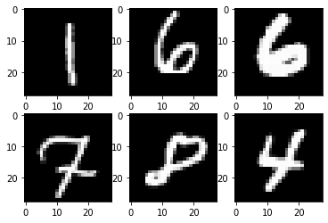

We have implemented base models for MNIST with keras. How can we implement more sophisticated version?

## Setups

what we need is tensorflow, keras mainly, and a bit of other libraries.


```python
import tensorflow as tf
from tensorflow import keras
import numpy as np
from sklearn.model_selection import train_test_split
import matplotlib.pyplot as plt
```

Check if gpu is available here. Are we good?


```python
device_name = tf.test.gpu_device_name()
if device_name != '/device:GPU:0':
  raise SystemError('GPU device not found')
print('Found GPU at: {}'.format(device_name))
```

```text
Found GPU at: /device:GPU:0

```

## Load Data, EDA, and preprocess


```python
(x_train, y_train), (x_test, y_test) = keras.datasets.mnist.load_data()
```


```python
x_train, x_val, y_train, y_val = train_test_split(x_train, y_train, test_size = 0.1, random_state = 42)
```


```python
x_train.shape, y_train.shape
```


```text
((54000, 28, 28), (54000,))
```


```python
x_val.shape, y_val.shape
```


```text
((6000, 28, 28), (6000,))
```


```python
x_test.shape, y_test.shape
```


```text
((10000, 28, 28), (10000,))
```


```python
x_train, x_val, x_test = x_train / 255.0, x_val / 255.0, x_test / 255.0
```


```python
y_train, y_val, y_test = tf.keras.utils.to_categorical(y_train), tf.keras.utils.to_categorical(y_val), tf.keras.utils.to_categorical(y_test)
```


```python
y_train[0]
```


```text
array([0., 1., 0., 0., 0., 0., 0., 0., 0., 0.], dtype=float32)
```


```python
for i in range(6):
    plt.subplot(2, 3, i+1)
    plt.imshow(x_train[i], cmap = "gray")
plt.show()
```





## Models

Let's set up some hyperparameters.


```python
BATCH_SIZE = 64
EPOCHS = 100
loss = keras.losses.CategoricalCrossentropy()
metrics = ["accuracy"]
```


```python
optimizer = keras.optimizers.SGD(learning_rate = 1e-03)
```

### MLP

Our first apporoach is Multi-layer Perceptron (MLP).

MLP introduces hidden layer with non-linear activation functions.

This combination can generate universal approximator. That is, theortically it can approximate every functions!


```python
MLL_model = keras.models.Sequential([
    keras.layers.Flatten(input_shape = (28, 28)),
    keras.layers.Dense(256, activation = "sigmoid"),
    keras.layers.Dense(128, activation = "sigmoid"),
    keras.layers.Dense(10, activation="softmax"),
])
```


```python
MLL_model.summary()
```

```text
Model: "sequential"
_________________________________________________________________
 Layer (type)                Output Shape              Param #   
=================================================================
 flatten (Flatten)           (None, 784)               0         
                                                                 
 dense (Dense)               (None, 256)               200960    
                                                                 
 dense_1 (Dense)             (None, 128)               32896     
                                                                 
 dense_2 (Dense)             (None, 10)                1290      
                                                                 
=================================================================
Total params: 235,146
Trainable params: 235,146
Non-trainable params: 0
_________________________________________________________________

```


```python
ckpt = tf.keras.callbacks.ModelCheckpoint(
    filepath="./best.ckpt",
    save_weights_only=True,
    monitor='val_accuracy',
    mode='max',
    save_best_only=True)
```


```python
MLL_model.compile(loss = loss, optimizer = optimizer, metrics = metrics)
```


```python
with tf.device(device_name = device_name):
    hist = MLL_model.fit(x_train, y_train, batch_size = BATCH_SIZE, epochs = EPOCHS, shuffle = True, verbose = 2, validation_data=(x_val, y_val))
```

```text
Epoch 1/100
844/844 - 9s - loss: 2.3369 - accuracy: 0.0925 - val_loss: 2.2991 - val_accuracy: 0.1048 - 9s/epoch - 10ms/step
Epoch 2/100
844/844 - 6s - loss: 2.2931 - accuracy: 0.1090 - val_loss: 2.2884 - val_accuracy: 0.1097 - 6s/epoch - 7ms/step
Epoch 3/100
844/844 - 4s - loss: 2.2823 - accuracy: 0.1243 - val_loss: 2.2775 - val_accuracy: 0.1630 - 4s/epoch - 5ms/step
Epoch 4/100
844/844 - 4s - loss: 2.2715 - accuracy: 0.1570 - val_loss: 2.2667 - val_accuracy: 0.2445 - 4s/epoch - 4ms/step
Epoch 5/100
844/844 - 3s - loss: 2.2606 - accuracy: 0.2233 - val_loss: 2.2560 - val_accuracy: 0.2190 - 3s/epoch - 3ms/step
Epoch 6/100
844/844 - 3s - loss: 2.2493 - accuracy: 0.2343 - val_loss: 2.2444 - val_accuracy: 0.3153 - 3s/epoch - 3ms/step
Epoch 7/100
844/844 - 3s - loss: 2.2378 - accuracy: 0.3005 - val_loss: 2.2327 - val_accuracy: 0.3302 - 3s/epoch - 3ms/step
Epoch 8/100
844/844 - 3s - loss: 2.2257 - accuracy: 0.3408 - val_loss: 2.2205 - val_accuracy: 0.3440 - 3s/epoch - 3ms/step
Epoch 9/100
844/844 - 3s - loss: 2.2132 - accuracy: 0.3778 - val_loss: 2.2081 - val_accuracy: 0.3505 - 3s/epoch - 3ms/step
Epoch 10/100
844/844 - 3s - loss: 2.2000 - accuracy: 0.4132 - val_loss: 2.1943 - val_accuracy: 0.3742 - 3s/epoch - 3ms/step
Epoch 11/100
844/844 - 3s - loss: 2.1861 - accuracy: 0.4260 - val_loss: 2.1797 - val_accuracy: 0.4393 - 3s/epoch - 3ms/step
Epoch 12/100
844/844 - 3s - loss: 2.1714 - accuracy: 0.4606 - val_loss: 2.1649 - val_accuracy: 0.4605 - 3s/epoch - 3ms/step
Epoch 13/100
844/844 - 3s - loss: 2.1557 - accuracy: 0.4830 - val_loss: 2.1487 - val_accuracy: 0.4720 - 3s/epoch - 3ms/step
Epoch 14/100
844/844 - 3s - loss: 2.1390 - accuracy: 0.4947 - val_loss: 2.1313 - val_accuracy: 0.5175 - 3s/epoch - 3ms/step
Epoch 15/100
844/844 - 3s - loss: 2.1212 - accuracy: 0.5257 - val_loss: 2.1130 - val_accuracy: 0.5203 - 3s/epoch - 3ms/step
Epoch 16/100
844/844 - 3s - loss: 2.1020 - accuracy: 0.5338 - val_loss: 2.0932 - val_accuracy: 0.5415 - 3s/epoch - 3ms/step
Epoch 17/100
844/844 - 3s - loss: 2.0816 - accuracy: 0.5467 - val_loss: 2.0723 - val_accuracy: 0.5558 - 3s/epoch - 3ms/step
Epoch 18/100
844/844 - 3s - loss: 2.0596 - accuracy: 0.5677 - val_loss: 2.0497 - val_accuracy: 0.5447 - 3s/epoch - 3ms/step
Epoch 19/100
844/844 - 3s - loss: 2.0362 - accuracy: 0.5698 - val_loss: 2.0254 - val_accuracy: 0.5683 - 3s/epoch - 3ms/step
Epoch 20/100
844/844 - 3s - loss: 2.0111 - accuracy: 0.5799 - val_loss: 1.9992 - val_accuracy: 0.5787 - 3s/epoch - 3ms/step
Epoch 21/100
844/844 - 3s - loss: 1.9843 - accuracy: 0.5916 - val_loss: 1.9718 - val_accuracy: 0.5877 - 3s/epoch - 3ms/step
Epoch 22/100
844/844 - 3s - loss: 1.9559 - accuracy: 0.6020 - val_loss: 1.9427 - val_accuracy: 0.5838 - 3s/epoch - 3ms/step
Epoch 23/100
844/844 - 3s - loss: 1.9257 - accuracy: 0.6031 - val_loss: 1.9118 - val_accuracy: 0.6095 - 3s/epoch - 3ms/step
Epoch 24/100
844/844 - 3s - loss: 1.8940 - accuracy: 0.6161 - val_loss: 1.8794 - val_accuracy: 0.6117 - 3s/epoch - 3ms/step
Epoch 25/100
844/844 - 3s - loss: 1.8606 - accuracy: 0.6199 - val_loss: 1.8453 - val_accuracy: 0.6340 - 3s/epoch - 3ms/step
Epoch 26/100
844/844 - 3s - loss: 1.8258 - accuracy: 0.6311 - val_loss: 1.8098 - val_accuracy: 0.6388 - 3s/epoch - 3ms/step
Epoch 27/100
844/844 - 3s - loss: 1.7897 - accuracy: 0.6401 - val_loss: 1.7733 - val_accuracy: 0.6432 - 3s/epoch - 3ms/step
Epoch 28/100
844/844 - 3s - loss: 1.7525 - accuracy: 0.6464 - val_loss: 1.7356 - val_accuracy: 0.6537 - 3s/epoch - 3ms/step
Epoch 29/100
844/844 - 3s - loss: 1.7145 - accuracy: 0.6535 - val_loss: 1.6974 - val_accuracy: 0.6633 - 3s/epoch - 3ms/step
Epoch 30/100
844/844 - 3s - loss: 1.6759 - accuracy: 0.6620 - val_loss: 1.6587 - val_accuracy: 0.6727 - 3s/epoch - 3ms/step
Epoch 31/100
844/844 - 3s - loss: 1.6369 - accuracy: 0.6706 - val_loss: 1.6199 - val_accuracy: 0.6757 - 3s/epoch - 3ms/step
Epoch 32/100
844/844 - 3s - loss: 1.5980 - accuracy: 0.6787 - val_loss: 1.5808 - val_accuracy: 0.6833 - 3s/epoch - 3ms/step
Epoch 33/100
844/844 - 3s - loss: 1.5591 - accuracy: 0.6851 - val_loss: 1.5423 - val_accuracy: 0.6877 - 3s/epoch - 3ms/step
Epoch 34/100
844/844 - 3s - loss: 1.5207 - accuracy: 0.6904 - val_loss: 1.5041 - val_accuracy: 0.7037 - 3s/epoch - 3ms/step
Epoch 35/100
844/844 - 3s - loss: 1.4829 - accuracy: 0.7022 - val_loss: 1.4666 - val_accuracy: 0.7027 - 3s/epoch - 4ms/step
Epoch 36/100
844/844 - 3s - loss: 1.4458 - accuracy: 0.7073 - val_loss: 1.4300 - val_accuracy: 0.7088 - 3s/epoch - 4ms/step
Epoch 37/100
844/844 - 3s - loss: 1.4096 - accuracy: 0.7152 - val_loss: 1.3942 - val_accuracy: 0.7120 - 3s/epoch - 3ms/step
Epoch 38/100
844/844 - 3s - loss: 1.3743 - accuracy: 0.7179 - val_loss: 1.3594 - val_accuracy: 0.7253 - 3s/epoch - 3ms/step
Epoch 39/100
844/844 - 3s - loss: 1.3401 - accuracy: 0.7266 - val_loss: 1.3258 - val_accuracy: 0.7272 - 3s/epoch - 3ms/step
Epoch 40/100
844/844 - 3s - loss: 1.3070 - accuracy: 0.7302 - val_loss: 1.2930 - val_accuracy: 0.7392 - 3s/epoch - 3ms/step
Epoch 41/100
844/844 - 3s - loss: 1.2749 - accuracy: 0.7368 - val_loss: 1.2617 - val_accuracy: 0.7397 - 3s/epoch - 3ms/step
Epoch 42/100
844/844 - 3s - loss: 1.2440 - accuracy: 0.7416 - val_loss: 1.2311 - val_accuracy: 0.7497 - 3s/epoch - 3ms/step
Epoch 43/100
844/844 - 3s - loss: 1.2142 - accuracy: 0.7470 - val_loss: 1.2017 - val_accuracy: 0.7510 - 3s/epoch - 3ms/step
Epoch 44/100
844/844 - 3s - loss: 1.1855 - accuracy: 0.7529 - val_loss: 1.1735 - val_accuracy: 0.7533 - 3s/epoch - 3ms/step
Epoch 45/100
844/844 - 3s - loss: 1.1579 - accuracy: 0.7559 - val_loss: 1.1461 - val_accuracy: 0.7625 - 3s/epoch - 3ms/step
Epoch 46/100
844/844 - 3s - loss: 1.1314 - accuracy: 0.7596 - val_loss: 1.1201 - val_accuracy: 0.7702 - 3s/epoch - 3ms/step
Epoch 47/100
844/844 - 3s - loss: 1.1059 - accuracy: 0.7656 - val_loss: 1.0949 - val_accuracy: 0.7710 - 3s/epoch - 3ms/step
Epoch 48/100
844/844 - 3s - loss: 1.0815 - accuracy: 0.7696 - val_loss: 1.0708 - val_accuracy: 0.7738 - 3s/epoch - 3ms/step
Epoch 49/100
844/844 - 3s - loss: 1.0580 - accuracy: 0.7727 - val_loss: 1.0476 - val_accuracy: 0.7792 - 3s/epoch - 3ms/step
Epoch 50/100
844/844 - 3s - loss: 1.0355 - accuracy: 0.7764 - val_loss: 1.0255 - val_accuracy: 0.7833 - 3s/epoch - 3ms/step
Epoch 51/100
844/844 - 3s - loss: 1.0139 - accuracy: 0.7794 - val_loss: 1.0043 - val_accuracy: 0.7870 - 3s/epoch - 3ms/step
Epoch 52/100
844/844 - 3s - loss: 0.9933 - accuracy: 0.7833 - val_loss: 0.9840 - val_accuracy: 0.7905 - 3s/epoch - 3ms/step
Epoch 53/100
844/844 - 3s - loss: 0.9735 - accuracy: 0.7863 - val_loss: 0.9643 - val_accuracy: 0.7925 - 3s/epoch - 3ms/step
Epoch 54/100
844/844 - 3s - loss: 0.9544 - accuracy: 0.7909 - val_loss: 0.9457 - val_accuracy: 0.7942 - 3s/epoch - 3ms/step
Epoch 55/100
844/844 - 3s - loss: 0.9363 - accuracy: 0.7922 - val_loss: 0.9276 - val_accuracy: 0.7998 - 3s/epoch - 3ms/step
Epoch 56/100
844/844 - 3s - loss: 0.9188 - accuracy: 0.7962 - val_loss: 0.9103 - val_accuracy: 0.8005 - 3s/epoch - 3ms/step
Epoch 57/100
844/844 - 3s - loss: 0.9021 - accuracy: 0.7981 - val_loss: 0.8938 - val_accuracy: 0.8040 - 3s/epoch - 3ms/step
Epoch 58/100
844/844 - 3s - loss: 0.8861 - accuracy: 0.8014 - val_loss: 0.8779 - val_accuracy: 0.8063 - 3s/epoch - 3ms/step
Epoch 59/100
844/844 - 3s - loss: 0.8707 - accuracy: 0.8038 - val_loss: 0.8627 - val_accuracy: 0.8082 - 3s/epoch - 3ms/step
Epoch 60/100
844/844 - 3s - loss: 0.8559 - accuracy: 0.8063 - val_loss: 0.8482 - val_accuracy: 0.8108 - 3s/epoch - 3ms/step
Epoch 61/100
844/844 - 3s - loss: 0.8417 - accuracy: 0.8085 - val_loss: 0.8341 - val_accuracy: 0.8138 - 3s/epoch - 3ms/step
Epoch 62/100
844/844 - 3s - loss: 0.8281 - accuracy: 0.8111 - val_loss: 0.8207 - val_accuracy: 0.8147 - 3s/epoch - 3ms/step
Epoch 63/100
844/844 - 3s - loss: 0.8150 - accuracy: 0.8130 - val_loss: 0.8077 - val_accuracy: 0.8178 - 3s/epoch - 3ms/step
Epoch 64/100
844/844 - 3s - loss: 0.8024 - accuracy: 0.8154 - val_loss: 0.7953 - val_accuracy: 0.8182 - 3s/epoch - 3ms/step
Epoch 65/100
844/844 - 3s - loss: 0.7903 - accuracy: 0.8171 - val_loss: 0.7834 - val_accuracy: 0.8207 - 3s/epoch - 3ms/step
Epoch 66/100
844/844 - 3s - loss: 0.7787 - accuracy: 0.8195 - val_loss: 0.7716 - val_accuracy: 0.8222 - 3s/epoch - 3ms/step
Epoch 67/100
844/844 - 3s - loss: 0.7675 - accuracy: 0.8215 - val_loss: 0.7605 - val_accuracy: 0.8245 - 3s/epoch - 3ms/step
Epoch 68/100
844/844 - 3s - loss: 0.7567 - accuracy: 0.8229 - val_loss: 0.7498 - val_accuracy: 0.8275 - 3s/epoch - 3ms/step
Epoch 69/100
844/844 - 3s - loss: 0.7463 - accuracy: 0.8253 - val_loss: 0.7396 - val_accuracy: 0.8280 - 3s/epoch - 3ms/step
Epoch 70/100
844/844 - 3s - loss: 0.7362 - accuracy: 0.8266 - val_loss: 0.7296 - val_accuracy: 0.8305 - 3s/epoch - 3ms/step
Epoch 71/100
844/844 - 3s - loss: 0.7266 - accuracy: 0.8283 - val_loss: 0.7200 - val_accuracy: 0.8327 - 3s/epoch - 3ms/step
Epoch 72/100
844/844 - 3s - loss: 0.7172 - accuracy: 0.8292 - val_loss: 0.7108 - val_accuracy: 0.8347 - 3s/epoch - 3ms/step
Epoch 73/100
844/844 - 3s - loss: 0.7082 - accuracy: 0.8312 - val_loss: 0.7017 - val_accuracy: 0.8385 - 3s/epoch - 3ms/step
Epoch 74/100
844/844 - 3s - loss: 0.6995 - accuracy: 0.8326 - val_loss: 0.6931 - val_accuracy: 0.8385 - 3s/epoch - 3ms/step
Epoch 75/100
844/844 - 3s - loss: 0.6911 - accuracy: 0.8337 - val_loss: 0.6847 - val_accuracy: 0.8415 - 3s/epoch - 3ms/step
Epoch 76/100
844/844 - 3s - loss: 0.6830 - accuracy: 0.8353 - val_loss: 0.6767 - val_accuracy: 0.8412 - 3s/epoch - 3ms/step
Epoch 77/100
844/844 - 3s - loss: 0.6752 - accuracy: 0.8363 - val_loss: 0.6689 - val_accuracy: 0.8437 - 3s/epoch - 3ms/step
Epoch 78/100
844/844 - 3s - loss: 0.6676 - accuracy: 0.8380 - val_loss: 0.6614 - val_accuracy: 0.8442 - 3s/epoch - 3ms/step
Epoch 79/100
844/844 - 3s - loss: 0.6602 - accuracy: 0.8396 - val_loss: 0.6541 - val_accuracy: 0.8447 - 3s/epoch - 3ms/step
Epoch 80/100
844/844 - 3s - loss: 0.6531 - accuracy: 0.8407 - val_loss: 0.6470 - val_accuracy: 0.8463 - 3s/epoch - 3ms/step
Epoch 81/100
844/844 - 3s - loss: 0.6463 - accuracy: 0.8420 - val_loss: 0.6401 - val_accuracy: 0.8467 - 3s/epoch - 3ms/step
Epoch 82/100
844/844 - 3s - loss: 0.6396 - accuracy: 0.8430 - val_loss: 0.6338 - val_accuracy: 0.8462 - 3s/epoch - 3ms/step
Epoch 83/100
844/844 - 3s - loss: 0.6332 - accuracy: 0.8439 - val_loss: 0.6272 - val_accuracy: 0.8478 - 3s/epoch - 3ms/step
Epoch 84/100
844/844 - 3s - loss: 0.6269 - accuracy: 0.8454 - val_loss: 0.6209 - val_accuracy: 0.8492 - 3s/epoch - 3ms/step
Epoch 85/100
844/844 - 3s - loss: 0.6208 - accuracy: 0.8465 - val_loss: 0.6150 - val_accuracy: 0.8515 - 3s/epoch - 3ms/step
Epoch 86/100
844/844 - 3s - loss: 0.6149 - accuracy: 0.8472 - val_loss: 0.6090 - val_accuracy: 0.8520 - 3s/epoch - 3ms/step
Epoch 87/100
844/844 - 3s - loss: 0.6092 - accuracy: 0.8483 - val_loss: 0.6034 - val_accuracy: 0.8532 - 3s/epoch - 3ms/step
Epoch 88/100
844/844 - 3s - loss: 0.6036 - accuracy: 0.8496 - val_loss: 0.5979 - val_accuracy: 0.8535 - 3s/epoch - 3ms/step
Epoch 89/100
844/844 - 3s - loss: 0.5983 - accuracy: 0.8501 - val_loss: 0.5925 - val_accuracy: 0.8552 - 3s/epoch - 3ms/step
Epoch 90/100
844/844 - 3s - loss: 0.5930 - accuracy: 0.8512 - val_loss: 0.5872 - val_accuracy: 0.8557 - 3s/epoch - 3ms/step
Epoch 91/100
844/844 - 3s - loss: 0.5879 - accuracy: 0.8521 - val_loss: 0.5821 - val_accuracy: 0.8553 - 3s/epoch - 3ms/step
Epoch 92/100
844/844 - 3s - loss: 0.5830 - accuracy: 0.8532 - val_loss: 0.5771 - val_accuracy: 0.8568 - 3s/epoch - 3ms/step
Epoch 93/100
844/844 - 3s - loss: 0.5782 - accuracy: 0.8535 - val_loss: 0.5723 - val_accuracy: 0.8573 - 3s/epoch - 3ms/step
Epoch 94/100
844/844 - 3s - loss: 0.5734 - accuracy: 0.8546 - val_loss: 0.5678 - val_accuracy: 0.8583 - 3s/epoch - 3ms/step
Epoch 95/100
844/844 - 3s - loss: 0.5689 - accuracy: 0.8553 - val_loss: 0.5630 - val_accuracy: 0.8590 - 3s/epoch - 3ms/step
Epoch 96/100
844/844 - 3s - loss: 0.5645 - accuracy: 0.8561 - val_loss: 0.5587 - val_accuracy: 0.8602 - 3s/epoch - 3ms/step
Epoch 97/100
844/844 - 3s - loss: 0.5601 - accuracy: 0.8570 - val_loss: 0.5545 - val_accuracy: 0.8613 - 3s/epoch - 3ms/step
Epoch 98/100
844/844 - 3s - loss: 0.5559 - accuracy: 0.8576 - val_loss: 0.5501 - val_accuracy: 0.8627 - 3s/epoch - 3ms/step
Epoch 99/100
844/844 - 3s - loss: 0.5518 - accuracy: 0.8581 - val_loss: 0.5461 - val_accuracy: 0.8628 - 3s/epoch - 3ms/step
Epoch 100/100
844/844 - 3s - loss: 0.5478 - accuracy: 0.8586 - val_loss: 0.5421 - val_accuracy: 0.8640 - 3s/epoch - 3ms/step

```


```python
with tf.device(device_name = device_name):
    MLL_model.evaluate(x_test, y_test, batch_size = BATCH_SIZE, verbose = 2)
```

```text
157/157 - 0s - loss: 0.5298 - accuracy: 0.8646 - 423ms/epoch - 3ms/step

```

### CNN

Convolutional neural network (CNN) performs great on most image tasks. Let's try this. 


```python
x_train, x_val, x_test = np.expand_dims(x_train, -1), np.expand_dims(x_val, -1), np.expand_dims(x_test, -1)
```


```python
x_train.shape, x_val.shape, x_test.shape
```


```text
((54000, 28, 28, 1), (6000, 28, 28, 1), (10000, 28, 28, 1))
```


```python
CNN_model = keras.models.Sequential([
    keras.layers.Conv2D(32, (3, 3), activation='relu', input_shape=(28, 28, 1)),
    keras.layers.MaxPooling2D((2, 2)),
    keras.layers.Flatten(),
    keras.layers.Dense(256, activation = "relu"),
    keras.layers.Dense(128, activation = "relu"),
    keras.layers.Dense(10, activation = "softmax"),
])

CNN_model.summary()
CNN_model.compile(loss = loss, optimizer = optimizer, metrics = metrics)

with tf.device(device_name = device_name):
    print("training start!")
    hist = CNN_model.fit(x_train, y_train, batch_size = BATCH_SIZE, epochs = EPOCHS, shuffle = True, verbose = 2, validation_data=(x_val, y_val))
    print("evaluation start!")
    CNN_model.evaluate(x_test, y_test, batch_size = BATCH_SIZE, verbose = 2)
```

```text
Model: "sequential_1"
_________________________________________________________________
 Layer (type)                Output Shape              Param #   
=================================================================
 conv2d (Conv2D)             (None, 26, 26, 32)        320       
                                                                 
 max_pooling2d (MaxPooling2D  (None, 13, 13, 32)       0         
 )                                                               
                                                                 
 flatten_1 (Flatten)         (None, 5408)              0         
                                                                 
 dense_3 (Dense)             (None, 256)               1384704   
                                                                 
 dense_4 (Dense)             (None, 128)               32896     
                                                                 
 dense_5 (Dense)             (None, 10)                1290      
                                                                 
=================================================================
Total params: 1,419,210
Trainable params: 1,419,210
Non-trainable params: 0
_________________________________________________________________
training start!
Epoch 1/100
844/844 - 12s - loss: 2.1092 - accuracy: 0.4856 - val_loss: 1.8201 - val_accuracy: 0.7348 - 12s/epoch - 14ms/step
Epoch 2/100
844/844 - 5s - loss: 1.2947 - accuracy: 0.7912 - val_loss: 0.8312 - val_accuracy: 0.8378 - 5s/epoch - 6ms/step
Epoch 3/100
844/844 - 5s - loss: 0.6397 - accuracy: 0.8520 - val_loss: 0.5152 - val_accuracy: 0.8727 - 5s/epoch - 6ms/step
Epoch 4/100
844/844 - 5s - loss: 0.4636 - accuracy: 0.8779 - val_loss: 0.4142 - val_accuracy: 0.8935 - 5s/epoch - 6ms/step
Epoch 5/100
844/844 - 5s - loss: 0.3961 - accuracy: 0.8900 - val_loss: 0.3656 - val_accuracy: 0.8995 - 5s/epoch - 6ms/step
Epoch 6/100
844/844 - 5s - loss: 0.3599 - accuracy: 0.8979 - val_loss: 0.3382 - val_accuracy: 0.9070 - 5s/epoch - 6ms/step
Epoch 7/100
844/844 - 5s - loss: 0.3363 - accuracy: 0.9034 - val_loss: 0.3166 - val_accuracy: 0.9098 - 5s/epoch - 6ms/step
Epoch 8/100
844/844 - 5s - loss: 0.3189 - accuracy: 0.9074 - val_loss: 0.3020 - val_accuracy: 0.9147 - 5s/epoch - 6ms/step
Epoch 9/100
844/844 - 5s - loss: 0.3051 - accuracy: 0.9116 - val_loss: 0.2890 - val_accuracy: 0.9157 - 5s/epoch - 6ms/step
Epoch 10/100
844/844 - 5s - loss: 0.2935 - accuracy: 0.9149 - val_loss: 0.2784 - val_accuracy: 0.9210 - 5s/epoch - 6ms/step
Epoch 11/100
844/844 - 5s - loss: 0.2830 - accuracy: 0.9180 - val_loss: 0.2696 - val_accuracy: 0.9230 - 5s/epoch - 6ms/step
Epoch 12/100
844/844 - 5s - loss: 0.2739 - accuracy: 0.9206 - val_loss: 0.2597 - val_accuracy: 0.9283 - 5s/epoch - 6ms/step
Epoch 13/100
844/844 - 5s - loss: 0.2655 - accuracy: 0.9229 - val_loss: 0.2523 - val_accuracy: 0.9283 - 5s/epoch - 5ms/step
Epoch 14/100
844/844 - 4s - loss: 0.2577 - accuracy: 0.9249 - val_loss: 0.2451 - val_accuracy: 0.9307 - 4s/epoch - 5ms/step
Epoch 15/100
844/844 - 5s - loss: 0.2503 - accuracy: 0.9279 - val_loss: 0.2372 - val_accuracy: 0.9342 - 5s/epoch - 6ms/step
Epoch 16/100
844/844 - 5s - loss: 0.2433 - accuracy: 0.9293 - val_loss: 0.2322 - val_accuracy: 0.9343 - 5s/epoch - 6ms/step
Epoch 17/100
844/844 - 4s - loss: 0.2366 - accuracy: 0.9314 - val_loss: 0.2263 - val_accuracy: 0.9372 - 4s/epoch - 5ms/step
Epoch 18/100
844/844 - 5s - loss: 0.2305 - accuracy: 0.9334 - val_loss: 0.2198 - val_accuracy: 0.9392 - 5s/epoch - 6ms/step
Epoch 19/100
844/844 - 5s - loss: 0.2246 - accuracy: 0.9346 - val_loss: 0.2149 - val_accuracy: 0.9388 - 5s/epoch - 6ms/step
Epoch 20/100
844/844 - 5s - loss: 0.2189 - accuracy: 0.9361 - val_loss: 0.2091 - val_accuracy: 0.9400 - 5s/epoch - 6ms/step
Epoch 21/100
844/844 - 5s - loss: 0.2138 - accuracy: 0.9376 - val_loss: 0.2044 - val_accuracy: 0.9423 - 5s/epoch - 6ms/step
Epoch 22/100
844/844 - 5s - loss: 0.2086 - accuracy: 0.9394 - val_loss: 0.2007 - val_accuracy: 0.9427 - 5s/epoch - 6ms/step
Epoch 23/100
844/844 - 5s - loss: 0.2036 - accuracy: 0.9409 - val_loss: 0.1956 - val_accuracy: 0.9452 - 5s/epoch - 6ms/step
Epoch 24/100
844/844 - 5s - loss: 0.1991 - accuracy: 0.9418 - val_loss: 0.1917 - val_accuracy: 0.9462 - 5s/epoch - 5ms/step
Epoch 25/100
844/844 - 5s - loss: 0.1946 - accuracy: 0.9432 - val_loss: 0.1877 - val_accuracy: 0.9463 - 5s/epoch - 5ms/step
Epoch 26/100
844/844 - 5s - loss: 0.1901 - accuracy: 0.9449 - val_loss: 0.1830 - val_accuracy: 0.9467 - 5s/epoch - 6ms/step
Epoch 27/100
844/844 - 4s - loss: 0.1861 - accuracy: 0.9454 - val_loss: 0.1814 - val_accuracy: 0.9483 - 4s/epoch - 5ms/step
Epoch 28/100
844/844 - 5s - loss: 0.1821 - accuracy: 0.9465 - val_loss: 0.1782 - val_accuracy: 0.9507 - 5s/epoch - 6ms/step
Epoch 29/100
844/844 - 5s - loss: 0.1784 - accuracy: 0.9478 - val_loss: 0.1732 - val_accuracy: 0.9515 - 5s/epoch - 6ms/step
Epoch 30/100
844/844 - 5s - loss: 0.1749 - accuracy: 0.9487 - val_loss: 0.1691 - val_accuracy: 0.9525 - 5s/epoch - 6ms/step
Epoch 31/100
844/844 - 5s - loss: 0.1712 - accuracy: 0.9499 - val_loss: 0.1657 - val_accuracy: 0.9535 - 5s/epoch - 6ms/step
Epoch 32/100
844/844 - 4s - loss: 0.1678 - accuracy: 0.9511 - val_loss: 0.1631 - val_accuracy: 0.9545 - 4s/epoch - 5ms/step
Epoch 33/100
844/844 - 5s - loss: 0.1646 - accuracy: 0.9516 - val_loss: 0.1605 - val_accuracy: 0.9553 - 5s/epoch - 5ms/step
Epoch 34/100
844/844 - 5s - loss: 0.1614 - accuracy: 0.9534 - val_loss: 0.1573 - val_accuracy: 0.9567 - 5s/epoch - 6ms/step
Epoch 35/100
844/844 - 4s - loss: 0.1584 - accuracy: 0.9537 - val_loss: 0.1559 - val_accuracy: 0.9575 - 4s/epoch - 5ms/step
Epoch 36/100
844/844 - 5s - loss: 0.1556 - accuracy: 0.9544 - val_loss: 0.1528 - val_accuracy: 0.9570 - 5s/epoch - 6ms/step
Epoch 37/100
844/844 - 5s - loss: 0.1527 - accuracy: 0.9553 - val_loss: 0.1512 - val_accuracy: 0.9587 - 5s/epoch - 6ms/step
Epoch 38/100
844/844 - 5s - loss: 0.1500 - accuracy: 0.9562 - val_loss: 0.1487 - val_accuracy: 0.9587 - 5s/epoch - 6ms/step
Epoch 39/100
844/844 - 5s - loss: 0.1472 - accuracy: 0.9572 - val_loss: 0.1460 - val_accuracy: 0.9593 - 5s/epoch - 6ms/step
Epoch 40/100
844/844 - 5s - loss: 0.1448 - accuracy: 0.9575 - val_loss: 0.1440 - val_accuracy: 0.9600 - 5s/epoch - 6ms/step
Epoch 41/100
844/844 - 5s - loss: 0.1423 - accuracy: 0.9586 - val_loss: 0.1413 - val_accuracy: 0.9600 - 5s/epoch - 6ms/step
Epoch 42/100
844/844 - 5s - loss: 0.1399 - accuracy: 0.9593 - val_loss: 0.1395 - val_accuracy: 0.9597 - 5s/epoch - 5ms/step
Epoch 43/100
844/844 - 5s - loss: 0.1376 - accuracy: 0.9602 - val_loss: 0.1379 - val_accuracy: 0.9612 - 5s/epoch - 5ms/step
Epoch 44/100
844/844 - 5s - loss: 0.1353 - accuracy: 0.9603 - val_loss: 0.1364 - val_accuracy: 0.9610 - 5s/epoch - 6ms/step
Epoch 45/100
844/844 - 5s - loss: 0.1332 - accuracy: 0.9613 - val_loss: 0.1338 - val_accuracy: 0.9627 - 5s/epoch - 5ms/step
Epoch 46/100
844/844 - 5s - loss: 0.1310 - accuracy: 0.9620 - val_loss: 0.1319 - val_accuracy: 0.9635 - 5s/epoch - 6ms/step
Epoch 47/100
844/844 - 5s - loss: 0.1290 - accuracy: 0.9629 - val_loss: 0.1299 - val_accuracy: 0.9625 - 5s/epoch - 6ms/step
Epoch 48/100
844/844 - 5s - loss: 0.1269 - accuracy: 0.9634 - val_loss: 0.1290 - val_accuracy: 0.9637 - 5s/epoch - 6ms/step
Epoch 49/100
844/844 - 5s - loss: 0.1251 - accuracy: 0.9641 - val_loss: 0.1283 - val_accuracy: 0.9647 - 5s/epoch - 5ms/step
Epoch 50/100
844/844 - 5s - loss: 0.1230 - accuracy: 0.9645 - val_loss: 0.1270 - val_accuracy: 0.9647 - 5s/epoch - 6ms/step
Epoch 51/100
844/844 - 5s - loss: 0.1212 - accuracy: 0.9649 - val_loss: 0.1236 - val_accuracy: 0.9660 - 5s/epoch - 6ms/step
Epoch 52/100
844/844 - 5s - loss: 0.1194 - accuracy: 0.9658 - val_loss: 0.1215 - val_accuracy: 0.9665 - 5s/epoch - 6ms/step
Epoch 53/100
844/844 - 5s - loss: 0.1177 - accuracy: 0.9659 - val_loss: 0.1212 - val_accuracy: 0.9668 - 5s/epoch - 5ms/step
Epoch 54/100
844/844 - 5s - loss: 0.1160 - accuracy: 0.9669 - val_loss: 0.1200 - val_accuracy: 0.9677 - 5s/epoch - 6ms/step
Epoch 55/100
844/844 - 5s - loss: 0.1141 - accuracy: 0.9671 - val_loss: 0.1189 - val_accuracy: 0.9678 - 5s/epoch - 5ms/step
Epoch 56/100
844/844 - 4s - loss: 0.1126 - accuracy: 0.9676 - val_loss: 0.1177 - val_accuracy: 0.9672 - 4s/epoch - 5ms/step
Epoch 57/100
844/844 - 4s - loss: 0.1111 - accuracy: 0.9681 - val_loss: 0.1155 - val_accuracy: 0.9682 - 4s/epoch - 5ms/step
Epoch 58/100
844/844 - 4s - loss: 0.1095 - accuracy: 0.9687 - val_loss: 0.1144 - val_accuracy: 0.9698 - 4s/epoch - 5ms/step
Epoch 59/100
844/844 - 5s - loss: 0.1079 - accuracy: 0.9689 - val_loss: 0.1132 - val_accuracy: 0.9687 - 5s/epoch - 6ms/step
Epoch 60/100
844/844 - 5s - loss: 0.1064 - accuracy: 0.9693 - val_loss: 0.1134 - val_accuracy: 0.9682 - 5s/epoch - 6ms/step
Epoch 61/100
844/844 - 5s - loss: 0.1051 - accuracy: 0.9697 - val_loss: 0.1107 - val_accuracy: 0.9688 - 5s/epoch - 5ms/step
Epoch 62/100
844/844 - 5s - loss: 0.1037 - accuracy: 0.9701 - val_loss: 0.1104 - val_accuracy: 0.9707 - 5s/epoch - 6ms/step
Epoch 63/100
844/844 - 5s - loss: 0.1022 - accuracy: 0.9707 - val_loss: 0.1095 - val_accuracy: 0.9693 - 5s/epoch - 6ms/step
Epoch 64/100
844/844 - 4s - loss: 0.1008 - accuracy: 0.9710 - val_loss: 0.1088 - val_accuracy: 0.9697 - 4s/epoch - 5ms/step
Epoch 65/100
844/844 - 5s - loss: 0.0997 - accuracy: 0.9713 - val_loss: 0.1078 - val_accuracy: 0.9697 - 5s/epoch - 6ms/step
Epoch 66/100
844/844 - 4s - loss: 0.0981 - accuracy: 0.9716 - val_loss: 0.1066 - val_accuracy: 0.9708 - 4s/epoch - 5ms/step
Epoch 67/100
844/844 - 5s - loss: 0.0970 - accuracy: 0.9722 - val_loss: 0.1053 - val_accuracy: 0.9702 - 5s/epoch - 6ms/step
Epoch 68/100
844/844 - 5s - loss: 0.0960 - accuracy: 0.9722 - val_loss: 0.1050 - val_accuracy: 0.9697 - 5s/epoch - 6ms/step
Epoch 69/100
844/844 - 5s - loss: 0.0945 - accuracy: 0.9728 - val_loss: 0.1023 - val_accuracy: 0.9703 - 5s/epoch - 6ms/step
Epoch 70/100
844/844 - 5s - loss: 0.0935 - accuracy: 0.9732 - val_loss: 0.1024 - val_accuracy: 0.9708 - 5s/epoch - 6ms/step
Epoch 71/100
844/844 - 5s - loss: 0.0924 - accuracy: 0.9735 - val_loss: 0.1017 - val_accuracy: 0.9715 - 5s/epoch - 6ms/step
Epoch 72/100
844/844 - 4s - loss: 0.0912 - accuracy: 0.9739 - val_loss: 0.0995 - val_accuracy: 0.9718 - 4s/epoch - 5ms/step
Epoch 73/100
844/844 - 4s - loss: 0.0901 - accuracy: 0.9743 - val_loss: 0.0998 - val_accuracy: 0.9713 - 4s/epoch - 5ms/step
Epoch 74/100
844/844 - 4s - loss: 0.0890 - accuracy: 0.9746 - val_loss: 0.0996 - val_accuracy: 0.9717 - 4s/epoch - 5ms/step
Epoch 75/100
844/844 - 4s - loss: 0.0879 - accuracy: 0.9747 - val_loss: 0.0973 - val_accuracy: 0.9723 - 4s/epoch - 5ms/step
Epoch 76/100
844/844 - 5s - loss: 0.0868 - accuracy: 0.9749 - val_loss: 0.0980 - val_accuracy: 0.9717 - 5s/epoch - 6ms/step
Epoch 77/100
844/844 - 5s - loss: 0.0858 - accuracy: 0.9750 - val_loss: 0.0961 - val_accuracy: 0.9728 - 5s/epoch - 6ms/step
Epoch 78/100
844/844 - 5s - loss: 0.0850 - accuracy: 0.9753 - val_loss: 0.0957 - val_accuracy: 0.9733 - 5s/epoch - 6ms/step
Epoch 79/100
844/844 - 5s - loss: 0.0840 - accuracy: 0.9757 - val_loss: 0.0966 - val_accuracy: 0.9723 - 5s/epoch - 6ms/step
Epoch 80/100
844/844 - 4s - loss: 0.0830 - accuracy: 0.9757 - val_loss: 0.0942 - val_accuracy: 0.9723 - 4s/epoch - 5ms/step
Epoch 81/100
844/844 - 4s - loss: 0.0820 - accuracy: 0.9765 - val_loss: 0.0926 - val_accuracy: 0.9742 - 4s/epoch - 5ms/step
Epoch 82/100
844/844 - 4s - loss: 0.0811 - accuracy: 0.9763 - val_loss: 0.0921 - val_accuracy: 0.9735 - 4s/epoch - 5ms/step
Epoch 83/100
844/844 - 4s - loss: 0.0802 - accuracy: 0.9767 - val_loss: 0.0916 - val_accuracy: 0.9730 - 4s/epoch - 5ms/step
Epoch 84/100
844/844 - 5s - loss: 0.0793 - accuracy: 0.9771 - val_loss: 0.0914 - val_accuracy: 0.9730 - 5s/epoch - 6ms/step
Epoch 85/100
844/844 - 5s - loss: 0.0784 - accuracy: 0.9774 - val_loss: 0.0914 - val_accuracy: 0.9747 - 5s/epoch - 5ms/step
Epoch 86/100
844/844 - 4s - loss: 0.0777 - accuracy: 0.9779 - val_loss: 0.0903 - val_accuracy: 0.9747 - 4s/epoch - 5ms/step
Epoch 87/100
844/844 - 4s - loss: 0.0768 - accuracy: 0.9780 - val_loss: 0.0891 - val_accuracy: 0.9755 - 4s/epoch - 5ms/step
Epoch 88/100
844/844 - 4s - loss: 0.0760 - accuracy: 0.9780 - val_loss: 0.0888 - val_accuracy: 0.9750 - 4s/epoch - 5ms/step
Epoch 89/100
844/844 - 5s - loss: 0.0752 - accuracy: 0.9780 - val_loss: 0.0889 - val_accuracy: 0.9753 - 5s/epoch - 6ms/step
Epoch 90/100
844/844 - 5s - loss: 0.0743 - accuracy: 0.9783 - val_loss: 0.0892 - val_accuracy: 0.9745 - 5s/epoch - 6ms/step
Epoch 91/100
844/844 - 4s - loss: 0.0735 - accuracy: 0.9786 - val_loss: 0.0890 - val_accuracy: 0.9748 - 4s/epoch - 5ms/step
Epoch 92/100
844/844 - 5s - loss: 0.0729 - accuracy: 0.9789 - val_loss: 0.0866 - val_accuracy: 0.9757 - 5s/epoch - 6ms/step
Epoch 93/100
844/844 - 5s - loss: 0.0721 - accuracy: 0.9794 - val_loss: 0.0871 - val_accuracy: 0.9752 - 5s/epoch - 6ms/step
Epoch 94/100
844/844 - 4s - loss: 0.0714 - accuracy: 0.9795 - val_loss: 0.0858 - val_accuracy: 0.9753 - 4s/epoch - 5ms/step
Epoch 95/100
844/844 - 5s - loss: 0.0706 - accuracy: 0.9794 - val_loss: 0.0859 - val_accuracy: 0.9747 - 5s/epoch - 6ms/step
Epoch 96/100
844/844 - 4s - loss: 0.0699 - accuracy: 0.9801 - val_loss: 0.0855 - val_accuracy: 0.9753 - 4s/epoch - 5ms/step
Epoch 97/100
844/844 - 5s - loss: 0.0692 - accuracy: 0.9802 - val_loss: 0.0847 - val_accuracy: 0.9755 - 5s/epoch - 6ms/step
Epoch 98/100
844/844 - 5s - loss: 0.0685 - accuracy: 0.9803 - val_loss: 0.0836 - val_accuracy: 0.9752 - 5s/epoch - 6ms/step
Epoch 99/100
844/844 - 5s - loss: 0.0677 - accuracy: 0.9809 - val_loss: 0.0833 - val_accuracy: 0.9770 - 5s/epoch - 6ms/step
Epoch 100/100
844/844 - 5s - loss: 0.0671 - accuracy: 0.9806 - val_loss: 0.0821 - val_accuracy: 0.9752 - 5s/epoch - 6ms/step
evaluation start!
157/157 - 1s - loss: 0.0808 - accuracy: 0.9739 - 725ms/epoch - 5ms/step

```

### Deeper CNN

What if we go deeper with CNN layers?


```python
Deeper_CNN_model = keras.models.Sequential([
    keras.layers.Conv2D(32, (3, 3), activation='relu', input_shape=(28, 28, 1)),
    keras.layers.MaxPooling2D((2, 2)),
    
    keras.layers.Conv2D(64, (3, 3), activation='relu'),
    keras.layers.MaxPooling2D((2, 2)),
    
    keras.layers.Conv2D(128, (3, 3), activation='relu'),
    keras.layers.MaxPooling2D((2, 2)),

    keras.layers.Flatten(),
    keras.layers.Dense(256, activation = "relu"),
    keras.layers.Dense(128, activation = "relu"),
    keras.layers.Dense(10, activation = "softmax"),
])

Deeper_CNN_model.summary()
Deeper_CNN_model.compile(loss = loss, optimizer = optimizer, metrics = metrics)

with tf.device(device_name = device_name):
    print("training start!")
    hist = Deeper_CNN_model.fit(x_train, y_train, batch_size = BATCH_SIZE, epochs = EPOCHS, shuffle = True, verbose = 2, validation_data=(x_val, y_val))
    print("evaluation start!")
    Deeper_CNN_model.evaluate(x_test, y_test, batch_size = BATCH_SIZE, verbose = 2)
```

```text
Model: "sequential_2"
_________________________________________________________________
 Layer (type)                Output Shape              Param #   
=================================================================
 conv2d_1 (Conv2D)           (None, 26, 26, 32)        320       
                                                                 
 max_pooling2d_1 (MaxPooling  (None, 13, 13, 32)       0         
 2D)                                                             
                                                                 
 conv2d_2 (Conv2D)           (None, 11, 11, 64)        18496     
                                                                 
 max_pooling2d_2 (MaxPooling  (None, 5, 5, 64)         0         
 2D)                                                             
                                                                 
 conv2d_3 (Conv2D)           (None, 3, 3, 128)         73856     
                                                                 
 max_pooling2d_3 (MaxPooling  (None, 1, 1, 128)        0         
 2D)                                                             
                                                                 
 flatten_2 (Flatten)         (None, 128)               0         
                                                                 
 dense_6 (Dense)             (None, 256)               33024     
                                                                 
 dense_7 (Dense)             (None, 128)               32896     
                                                                 
 dense_8 (Dense)             (None, 10)                1290      
                                                                 
=================================================================
Total params: 159,882
Trainable params: 159,882
Non-trainable params: 0
_________________________________________________________________
training start!
Epoch 1/100
844/844 - 7s - loss: 2.2968 - accuracy: 0.1884 - val_loss: 2.2884 - val_accuracy: 0.2282 - 7s/epoch - 9ms/step
Epoch 2/100
844/844 - 6s - loss: 2.2780 - accuracy: 0.2637 - val_loss: 2.2675 - val_accuracy: 0.3078 - 6s/epoch - 7ms/step
Epoch 3/100
844/844 - 6s - loss: 2.2511 - accuracy: 0.3393 - val_loss: 2.2325 - val_accuracy: 0.3722 - 6s/epoch - 7ms/step
Epoch 4/100
844/844 - 6s - loss: 2.1966 - accuracy: 0.4350 - val_loss: 2.1506 - val_accuracy: 0.5238 - 6s/epoch - 7ms/step
Epoch 5/100
844/844 - 6s - loss: 2.0415 - accuracy: 0.5842 - val_loss: 1.8822 - val_accuracy: 0.6298 - 6s/epoch - 7ms/step
Epoch 6/100
844/844 - 6s - loss: 1.5455 - accuracy: 0.6829 - val_loss: 1.1778 - val_accuracy: 0.7368 - 6s/epoch - 7ms/step
Epoch 7/100
844/844 - 6s - loss: 0.9104 - accuracy: 0.7804 - val_loss: 0.7168 - val_accuracy: 0.8167 - 6s/epoch - 7ms/step
Epoch 8/100
844/844 - 6s - loss: 0.6176 - accuracy: 0.8351 - val_loss: 0.5265 - val_accuracy: 0.8558 - 6s/epoch - 7ms/step
Epoch 9/100
844/844 - 6s - loss: 0.4845 - accuracy: 0.8647 - val_loss: 0.4266 - val_accuracy: 0.8782 - 6s/epoch - 7ms/step
Epoch 10/100
844/844 - 6s - loss: 0.4071 - accuracy: 0.8833 - val_loss: 0.3721 - val_accuracy: 0.8915 - 6s/epoch - 7ms/step
Epoch 11/100
844/844 - 6s - loss: 0.3562 - accuracy: 0.8957 - val_loss: 0.3230 - val_accuracy: 0.9005 - 6s/epoch - 7ms/step
Epoch 12/100
844/844 - 6s - loss: 0.3194 - accuracy: 0.9048 - val_loss: 0.2922 - val_accuracy: 0.9127 - 6s/epoch - 7ms/step
Epoch 13/100
844/844 - 6s - loss: 0.2908 - accuracy: 0.9119 - val_loss: 0.2721 - val_accuracy: 0.9167 - 6s/epoch - 7ms/step
Epoch 14/100
844/844 - 6s - loss: 0.2677 - accuracy: 0.9192 - val_loss: 0.2453 - val_accuracy: 0.9250 - 6s/epoch - 7ms/step
Epoch 15/100
844/844 - 6s - loss: 0.2491 - accuracy: 0.9248 - val_loss: 0.2278 - val_accuracy: 0.9322 - 6s/epoch - 7ms/step
Epoch 16/100
844/844 - 6s - loss: 0.2332 - accuracy: 0.9294 - val_loss: 0.2175 - val_accuracy: 0.9348 - 6s/epoch - 7ms/step
Epoch 17/100
844/844 - 6s - loss: 0.2199 - accuracy: 0.9326 - val_loss: 0.2023 - val_accuracy: 0.9388 - 6s/epoch - 7ms/step
Epoch 18/100
844/844 - 6s - loss: 0.2086 - accuracy: 0.9368 - val_loss: 0.1957 - val_accuracy: 0.9405 - 6s/epoch - 7ms/step
Epoch 19/100
844/844 - 6s - loss: 0.1989 - accuracy: 0.9397 - val_loss: 0.1866 - val_accuracy: 0.9443 - 6s/epoch - 7ms/step
Epoch 20/100
844/844 - 6s - loss: 0.1894 - accuracy: 0.9418 - val_loss: 0.1783 - val_accuracy: 0.9470 - 6s/epoch - 7ms/step
Epoch 21/100
844/844 - 6s - loss: 0.1816 - accuracy: 0.9447 - val_loss: 0.1734 - val_accuracy: 0.9492 - 6s/epoch - 7ms/step
Epoch 22/100
844/844 - 6s - loss: 0.1744 - accuracy: 0.9466 - val_loss: 0.1637 - val_accuracy: 0.9515 - 6s/epoch - 7ms/step
Epoch 23/100
844/844 - 6s - loss: 0.1687 - accuracy: 0.9488 - val_loss: 0.1611 - val_accuracy: 0.9515 - 6s/epoch - 7ms/step
Epoch 24/100
844/844 - 6s - loss: 0.1626 - accuracy: 0.9500 - val_loss: 0.1590 - val_accuracy: 0.9517 - 6s/epoch - 7ms/step
Epoch 25/100
844/844 - 6s - loss: 0.1570 - accuracy: 0.9515 - val_loss: 0.1527 - val_accuracy: 0.9538 - 6s/epoch - 7ms/step
Epoch 26/100
844/844 - 6s - loss: 0.1525 - accuracy: 0.9536 - val_loss: 0.1465 - val_accuracy: 0.9557 - 6s/epoch - 7ms/step
Epoch 27/100
844/844 - 6s - loss: 0.1481 - accuracy: 0.9553 - val_loss: 0.1445 - val_accuracy: 0.9550 - 6s/epoch - 7ms/step
Epoch 28/100
844/844 - 6s - loss: 0.1435 - accuracy: 0.9561 - val_loss: 0.1413 - val_accuracy: 0.9578 - 6s/epoch - 7ms/step
Epoch 29/100
844/844 - 6s - loss: 0.1400 - accuracy: 0.9572 - val_loss: 0.1351 - val_accuracy: 0.9582 - 6s/epoch - 7ms/step
Epoch 30/100
844/844 - 6s - loss: 0.1357 - accuracy: 0.9587 - val_loss: 0.1337 - val_accuracy: 0.9587 - 6s/epoch - 7ms/step
Epoch 31/100
844/844 - 6s - loss: 0.1326 - accuracy: 0.9587 - val_loss: 0.1311 - val_accuracy: 0.9607 - 6s/epoch - 7ms/step
Epoch 32/100
844/844 - 6s - loss: 0.1297 - accuracy: 0.9607 - val_loss: 0.1323 - val_accuracy: 0.9622 - 6s/epoch - 7ms/step
Epoch 33/100
844/844 - 6s - loss: 0.1264 - accuracy: 0.9610 - val_loss: 0.1269 - val_accuracy: 0.9610 - 6s/epoch - 7ms/step
Epoch 34/100
844/844 - 6s - loss: 0.1235 - accuracy: 0.9620 - val_loss: 0.1229 - val_accuracy: 0.9638 - 6s/epoch - 7ms/step
Epoch 35/100
844/844 - 6s - loss: 0.1212 - accuracy: 0.9631 - val_loss: 0.1206 - val_accuracy: 0.9620 - 6s/epoch - 7ms/step
Epoch 36/100
844/844 - 6s - loss: 0.1187 - accuracy: 0.9630 - val_loss: 0.1237 - val_accuracy: 0.9623 - 6s/epoch - 7ms/step
Epoch 37/100
844/844 - 6s - loss: 0.1164 - accuracy: 0.9648 - val_loss: 0.1230 - val_accuracy: 0.9638 - 6s/epoch - 7ms/step
Epoch 38/100
844/844 - 6s - loss: 0.1134 - accuracy: 0.9657 - val_loss: 0.1174 - val_accuracy: 0.9627 - 6s/epoch - 7ms/step
Epoch 39/100
844/844 - 6s - loss: 0.1115 - accuracy: 0.9654 - val_loss: 0.1144 - val_accuracy: 0.9648 - 6s/epoch - 7ms/step
Epoch 40/100
844/844 - 6s - loss: 0.1096 - accuracy: 0.9669 - val_loss: 0.1091 - val_accuracy: 0.9678 - 6s/epoch - 7ms/step
Epoch 41/100
844/844 - 6s - loss: 0.1078 - accuracy: 0.9674 - val_loss: 0.1136 - val_accuracy: 0.9653 - 6s/epoch - 7ms/step
Epoch 42/100
844/844 - 6s - loss: 0.1052 - accuracy: 0.9680 - val_loss: 0.1117 - val_accuracy: 0.9672 - 6s/epoch - 7ms/step
Epoch 43/100
844/844 - 6s - loss: 0.1034 - accuracy: 0.9678 - val_loss: 0.1086 - val_accuracy: 0.9682 - 6s/epoch - 7ms/step
Epoch 44/100
844/844 - 6s - loss: 0.1020 - accuracy: 0.9689 - val_loss: 0.1026 - val_accuracy: 0.9695 - 6s/epoch - 7ms/step
Epoch 45/100
844/844 - 6s - loss: 0.1004 - accuracy: 0.9699 - val_loss: 0.1065 - val_accuracy: 0.9662 - 6s/epoch - 7ms/step
Epoch 46/100
844/844 - 6s - loss: 0.0987 - accuracy: 0.9698 - val_loss: 0.1030 - val_accuracy: 0.9702 - 6s/epoch - 7ms/step
Epoch 47/100
844/844 - 6s - loss: 0.0973 - accuracy: 0.9704 - val_loss: 0.1001 - val_accuracy: 0.9702 - 6s/epoch - 7ms/step
Epoch 48/100
844/844 - 6s - loss: 0.0958 - accuracy: 0.9704 - val_loss: 0.0997 - val_accuracy: 0.9712 - 6s/epoch - 7ms/step
Epoch 49/100
844/844 - 6s - loss: 0.0939 - accuracy: 0.9722 - val_loss: 0.1054 - val_accuracy: 0.9682 - 6s/epoch - 7ms/step
Epoch 50/100
844/844 - 6s - loss: 0.0925 - accuracy: 0.9716 - val_loss: 0.0983 - val_accuracy: 0.9702 - 6s/epoch - 7ms/step
Epoch 51/100
844/844 - 6s - loss: 0.0910 - accuracy: 0.9727 - val_loss: 0.0961 - val_accuracy: 0.9723 - 6s/epoch - 7ms/step
Epoch 52/100
844/844 - 6s - loss: 0.0902 - accuracy: 0.9730 - val_loss: 0.0965 - val_accuracy: 0.9722 - 6s/epoch - 7ms/step
Epoch 53/100
844/844 - 6s - loss: 0.0889 - accuracy: 0.9733 - val_loss: 0.1022 - val_accuracy: 0.9692 - 6s/epoch - 7ms/step
Epoch 54/100
844/844 - 6s - loss: 0.0875 - accuracy: 0.9733 - val_loss: 0.0964 - val_accuracy: 0.9707 - 6s/epoch - 7ms/step
Epoch 55/100
844/844 - 6s - loss: 0.0858 - accuracy: 0.9737 - val_loss: 0.0933 - val_accuracy: 0.9732 - 6s/epoch - 7ms/step
Epoch 56/100
844/844 - 6s - loss: 0.0852 - accuracy: 0.9744 - val_loss: 0.0921 - val_accuracy: 0.9723 - 6s/epoch - 7ms/step
Epoch 57/100
844/844 - 5s - loss: 0.0837 - accuracy: 0.9748 - val_loss: 0.0906 - val_accuracy: 0.9723 - 5s/epoch - 7ms/step
Epoch 58/100
844/844 - 6s - loss: 0.0830 - accuracy: 0.9746 - val_loss: 0.0946 - val_accuracy: 0.9728 - 6s/epoch - 7ms/step
Epoch 59/100
844/844 - 6s - loss: 0.0818 - accuracy: 0.9752 - val_loss: 0.0935 - val_accuracy: 0.9720 - 6s/epoch - 7ms/step
Epoch 60/100
844/844 - 6s - loss: 0.0806 - accuracy: 0.9756 - val_loss: 0.0868 - val_accuracy: 0.9740 - 6s/epoch - 7ms/step
Epoch 61/100
844/844 - 6s - loss: 0.0795 - accuracy: 0.9763 - val_loss: 0.0879 - val_accuracy: 0.9737 - 6s/epoch - 7ms/step
Epoch 62/100
844/844 - 6s - loss: 0.0787 - accuracy: 0.9763 - val_loss: 0.0938 - val_accuracy: 0.9712 - 6s/epoch - 7ms/step
Epoch 63/100
844/844 - 6s - loss: 0.0780 - accuracy: 0.9769 - val_loss: 0.0905 - val_accuracy: 0.9717 - 6s/epoch - 7ms/step
Epoch 64/100
844/844 - 6s - loss: 0.0767 - accuracy: 0.9766 - val_loss: 0.0892 - val_accuracy: 0.9720 - 6s/epoch - 7ms/step
Epoch 65/100
844/844 - 6s - loss: 0.0760 - accuracy: 0.9771 - val_loss: 0.0837 - val_accuracy: 0.9748 - 6s/epoch - 7ms/step
Epoch 66/100
844/844 - 6s - loss: 0.0748 - accuracy: 0.9779 - val_loss: 0.0834 - val_accuracy: 0.9738 - 6s/epoch - 7ms/step
Epoch 67/100
844/844 - 6s - loss: 0.0742 - accuracy: 0.9777 - val_loss: 0.0859 - val_accuracy: 0.9727 - 6s/epoch - 7ms/step
Epoch 68/100
844/844 - 6s - loss: 0.0728 - accuracy: 0.9784 - val_loss: 0.0983 - val_accuracy: 0.9705 - 6s/epoch - 7ms/step
Epoch 69/100
844/844 - 6s - loss: 0.0727 - accuracy: 0.9782 - val_loss: 0.0851 - val_accuracy: 0.9743 - 6s/epoch - 7ms/step
Epoch 70/100
844/844 - 6s - loss: 0.0714 - accuracy: 0.9790 - val_loss: 0.0829 - val_accuracy: 0.9753 - 6s/epoch - 7ms/step
Epoch 71/100
844/844 - 6s - loss: 0.0708 - accuracy: 0.9783 - val_loss: 0.0955 - val_accuracy: 0.9718 - 6s/epoch - 7ms/step
Epoch 72/100
844/844 - 6s - loss: 0.0698 - accuracy: 0.9789 - val_loss: 0.0887 - val_accuracy: 0.9730 - 6s/epoch - 7ms/step
Epoch 73/100
844/844 - 6s - loss: 0.0692 - accuracy: 0.9792 - val_loss: 0.0849 - val_accuracy: 0.9740 - 6s/epoch - 7ms/step
Epoch 74/100
844/844 - 6s - loss: 0.0683 - accuracy: 0.9797 - val_loss: 0.0868 - val_accuracy: 0.9745 - 6s/epoch - 7ms/step
Epoch 75/100
844/844 - 6s - loss: 0.0680 - accuracy: 0.9794 - val_loss: 0.0810 - val_accuracy: 0.9755 - 6s/epoch - 7ms/step
Epoch 76/100
844/844 - 6s - loss: 0.0674 - accuracy: 0.9797 - val_loss: 0.0846 - val_accuracy: 0.9737 - 6s/epoch - 7ms/step
Epoch 77/100
844/844 - 6s - loss: 0.0667 - accuracy: 0.9793 - val_loss: 0.0830 - val_accuracy: 0.9742 - 6s/epoch - 7ms/step
Epoch 78/100
844/844 - 6s - loss: 0.0659 - accuracy: 0.9803 - val_loss: 0.0792 - val_accuracy: 0.9758 - 6s/epoch - 7ms/step
Epoch 79/100
844/844 - 6s - loss: 0.0652 - accuracy: 0.9805 - val_loss: 0.0793 - val_accuracy: 0.9762 - 6s/epoch - 7ms/step
Epoch 80/100
844/844 - 6s - loss: 0.0643 - accuracy: 0.9810 - val_loss: 0.0858 - val_accuracy: 0.9743 - 6s/epoch - 7ms/step
Epoch 81/100
844/844 - 6s - loss: 0.0639 - accuracy: 0.9810 - val_loss: 0.0770 - val_accuracy: 0.9758 - 6s/epoch - 7ms/step
Epoch 82/100
844/844 - 6s - loss: 0.0632 - accuracy: 0.9812 - val_loss: 0.0804 - val_accuracy: 0.9745 - 6s/epoch - 7ms/step
Epoch 83/100
844/844 - 6s - loss: 0.0622 - accuracy: 0.9815 - val_loss: 0.0762 - val_accuracy: 0.9752 - 6s/epoch - 7ms/step
Epoch 84/100
844/844 - 6s - loss: 0.0619 - accuracy: 0.9815 - val_loss: 0.0756 - val_accuracy: 0.9753 - 6s/epoch - 7ms/step
Epoch 85/100
844/844 - 6s - loss: 0.0610 - accuracy: 0.9817 - val_loss: 0.0750 - val_accuracy: 0.9753 - 6s/epoch - 7ms/step
Epoch 86/100
844/844 - 6s - loss: 0.0602 - accuracy: 0.9819 - val_loss: 0.0857 - val_accuracy: 0.9730 - 6s/epoch - 7ms/step
Epoch 87/100
844/844 - 6s - loss: 0.0600 - accuracy: 0.9823 - val_loss: 0.0775 - val_accuracy: 0.9770 - 6s/epoch - 7ms/step
Epoch 88/100
844/844 - 6s - loss: 0.0595 - accuracy: 0.9825 - val_loss: 0.0759 - val_accuracy: 0.9777 - 6s/epoch - 7ms/step
Epoch 89/100
844/844 - 6s - loss: 0.0591 - accuracy: 0.9826 - val_loss: 0.0776 - val_accuracy: 0.9770 - 6s/epoch - 7ms/step
Epoch 90/100
844/844 - 6s - loss: 0.0584 - accuracy: 0.9822 - val_loss: 0.0779 - val_accuracy: 0.9752 - 6s/epoch - 7ms/step
Epoch 91/100
844/844 - 6s - loss: 0.0578 - accuracy: 0.9830 - val_loss: 0.0780 - val_accuracy: 0.9750 - 6s/epoch - 7ms/step
Epoch 92/100
844/844 - 6s - loss: 0.0575 - accuracy: 0.9832 - val_loss: 0.0821 - val_accuracy: 0.9758 - 6s/epoch - 7ms/step
Epoch 93/100
844/844 - 6s - loss: 0.0568 - accuracy: 0.9830 - val_loss: 0.0790 - val_accuracy: 0.9763 - 6s/epoch - 7ms/step
Epoch 94/100
844/844 - 6s - loss: 0.0564 - accuracy: 0.9832 - val_loss: 0.0741 - val_accuracy: 0.9767 - 6s/epoch - 7ms/step
Epoch 95/100
844/844 - 6s - loss: 0.0559 - accuracy: 0.9834 - val_loss: 0.0771 - val_accuracy: 0.9763 - 6s/epoch - 7ms/step
Epoch 96/100
844/844 - 6s - loss: 0.0554 - accuracy: 0.9834 - val_loss: 0.0725 - val_accuracy: 0.9772 - 6s/epoch - 7ms/step
Epoch 97/100
844/844 - 6s - loss: 0.0544 - accuracy: 0.9837 - val_loss: 0.0760 - val_accuracy: 0.9775 - 6s/epoch - 7ms/step
Epoch 98/100
844/844 - 6s - loss: 0.0544 - accuracy: 0.9839 - val_loss: 0.0720 - val_accuracy: 0.9772 - 6s/epoch - 7ms/step
Epoch 99/100
844/844 - 6s - loss: 0.0540 - accuracy: 0.9844 - val_loss: 0.0770 - val_accuracy: 0.9770 - 6s/epoch - 7ms/step
Epoch 100/100
844/844 - 6s - loss: 0.0535 - accuracy: 0.9844 - val_loss: 0.0784 - val_accuracy: 0.9763 - 6s/epoch - 7ms/step
evaluation start!
157/157 - 1s - loss: 0.0749 - accuracy: 0.9781 - 612ms/epoch - 4ms/step

```

### Deeper CNN with better Optimizer and Batchnorm

Batchnorm was introduced to stablize the training process. Let's try them! Also, let's try with better optimizer, Adam.


```python
adam_optimizer = tf.optimizers.Adam(learning_rate=1e-03)
```


```python
Deeper_CNN_model = keras.models.Sequential([
    keras.layers.Conv2D(32, (3, 3), padding = "same", input_shape=(28, 28, 1)),
    keras.layers.Conv2D(32, (3, 3), padding = "same", input_shape=(28, 28, 1)),
    keras.layers.ReLU(),
    keras.layers.MaxPooling2D((2, 2)),
    keras.layers.BatchNormalization(),
    
    keras.layers.Conv2D(64, (3, 3), padding = "same"),
    keras.layers.Conv2D(64, (3, 3), padding = "same"),
    keras.layers.ReLU(),
    keras.layers.MaxPooling2D((2, 2)),
    keras.layers.BatchNormalization(),

    keras.layers.Conv2D(128, (3, 3), padding = "same"),
    keras.layers.Conv2D(128, (3, 3), padding = "same"),
    keras.layers.MaxPooling2D((2, 2)),
    keras.layers.BatchNormalization(),

    keras.layers.Flatten(),
    keras.layers.Dense(256),
    keras.layers.Dense(128),
    keras.layers.Dense(10),
    keras.layers.Softmax()
])

Deeper_CNN_model.summary()
Deeper_CNN_model.compile(loss = loss, optimizer = adam_optimizer, metrics = metrics)

with tf.device(device_name = device_name):
    print("training start!")
    hist = Deeper_CNN_model.fit(x_train, y_train, batch_size = BATCH_SIZE, epochs = EPOCHS, shuffle = True, verbose = 2, validation_data=(x_val, y_val))
    print("evaluation start!")
    Deeper_CNN_model.evaluate(x_test, y_test, batch_size = BATCH_SIZE, verbose = 2)
```

```text
Model: "sequential_3"
_________________________________________________________________
 Layer (type)                Output Shape              Param #   
=================================================================
 conv2d_4 (Conv2D)           (None, 28, 28, 32)        320       
                                                                 
 conv2d_5 (Conv2D)           (None, 28, 28, 32)        9248      
                                                                 
 re_lu (ReLU)                (None, 28, 28, 32)        0         
                                                                 
 max_pooling2d_4 (MaxPooling  (None, 14, 14, 32)       0         
 2D)                                                             
                                                                 
 batch_normalization (BatchN  (None, 14, 14, 32)       128       
 ormalization)                                                   
                                                                 
 conv2d_6 (Conv2D)           (None, 14, 14, 64)        18496     
                                                                 
 conv2d_7 (Conv2D)           (None, 14, 14, 64)        36928     
                                                                 
 re_lu_1 (ReLU)              (None, 14, 14, 64)        0         
                                                                 
 max_pooling2d_5 (MaxPooling  (None, 7, 7, 64)         0         
 2D)                                                             
                                                                 
 batch_normalization_1 (Batc  (None, 7, 7, 64)         256       
 hNormalization)                                                 
                                                                 
 conv2d_8 (Conv2D)           (None, 7, 7, 128)         73856     
                                                                 
 conv2d_9 (Conv2D)           (None, 7, 7, 128)         147584    
                                                                 
 max_pooling2d_6 (MaxPooling  (None, 3, 3, 128)        0         
 2D)                                                             
                                                                 
 batch_normalization_2 (Batc  (None, 3, 3, 128)        512       
 hNormalization)                                                 
                                                                 
 flatten_3 (Flatten)         (None, 1152)              0         
                                                                 
 dense_9 (Dense)             (None, 256)               295168    
                                                                 
 dense_10 (Dense)            (None, 128)               32896     
                                                                 
 dense_11 (Dense)            (None, 10)                1290      
                                                                 
 softmax (Softmax)           (None, 10)                0         
                                                                 
=================================================================
Total params: 616,682
Trainable params: 616,234
Non-trainable params: 448
_________________________________________________________________
training start!
Epoch 1/100
844/844 - 14s - loss: 0.1488 - accuracy: 0.9627 - val_loss: 0.0980 - val_accuracy: 0.9725 - 14s/epoch - 16ms/step
Epoch 2/100
844/844 - 12s - loss: 0.0660 - accuracy: 0.9817 - val_loss: 0.0855 - val_accuracy: 0.9763 - 12s/epoch - 14ms/step
Epoch 3/100
844/844 - 12s - loss: 0.0527 - accuracy: 0.9856 - val_loss: 0.0480 - val_accuracy: 0.9863 - 12s/epoch - 14ms/step
Epoch 4/100
844/844 - 12s - loss: 0.0430 - accuracy: 0.9874 - val_loss: 0.0474 - val_accuracy: 0.9880 - 12s/epoch - 14ms/step
Epoch 5/100
844/844 - 12s - loss: 0.0350 - accuracy: 0.9896 - val_loss: 0.0657 - val_accuracy: 0.9865 - 12s/epoch - 14ms/step
Epoch 6/100
844/844 - 12s - loss: 0.0327 - accuracy: 0.9905 - val_loss: 0.0531 - val_accuracy: 0.9852 - 12s/epoch - 14ms/step
Epoch 7/100
844/844 - 12s - loss: 0.0269 - accuracy: 0.9918 - val_loss: 0.0529 - val_accuracy: 0.9862 - 12s/epoch - 14ms/step
Epoch 8/100
844/844 - 12s - loss: 0.0255 - accuracy: 0.9924 - val_loss: 0.0611 - val_accuracy: 0.9837 - 12s/epoch - 14ms/step
Epoch 9/100
844/844 - 12s - loss: 0.0215 - accuracy: 0.9934 - val_loss: 0.0431 - val_accuracy: 0.9890 - 12s/epoch - 14ms/step
Epoch 10/100
844/844 - 12s - loss: 0.0240 - accuracy: 0.9925 - val_loss: 0.0515 - val_accuracy: 0.9880 - 12s/epoch - 14ms/step
Epoch 11/100
844/844 - 12s - loss: 0.0177 - accuracy: 0.9944 - val_loss: 0.0361 - val_accuracy: 0.9912 - 12s/epoch - 14ms/step
Epoch 12/100

```


Here, we have achieved about 99% accuracy! Well done!
