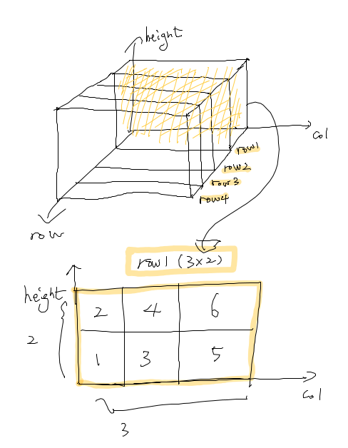

To play with numpy, it is necessary to handle the shape of an array as desired.

# To start

First things first. Let's import the numpy library first.

```python
import numpy as np
```

Next, Let's define our array as follows.

```python
arr = np.arange(1, 25, 1) # numpy.arange([start, ] stop, [step, ] dtype=None)
arr
```

Numpy **arange** function returns an array with starting/ending point(first/second argument), also with a step. 

Therefore it will return an array of length 24, increasing from 1. 

```
array([ 1,  2,  3,  4,  5,  6,  7,  8,  9, 10, 11, 12, 13, 14, 15, 16, 17,
       18, 19, 20, 21, 22, 23, 24])
```


# Shape

## Checking the shape

To check the shape of the array, two functions are available.

```python
arr.shape
```

```python
np.shape(arr)
```

Both will return:

```
(24,)
```

This says that we have rank 1 matrix, with 24 components.

## Reshape

What I want to do now, is to convert this array into 2D with 4 rows and 6 columns.

This can be done using **np.reshape()** function.

```python
arr2d = np.reshape(arr, (4, 6))
arr2d
```

output is:

```
array([[ 1,  2,  3,  4,  5,  6],
       [ 7,  8,  9, 10, 11, 12],
       [13, 14, 15, 16, 17, 18],
       [19, 20, 21, 22, 23, 24]])
```

with

```python
np.shape(arr2d)
```

```
(4, 6)
```


How about in 3D? Let's take dimension to be *(4, 3, 2)*.

```python
arr3d = np.reshape(arr, (4, 3, 2))
arr3d
```

output is:

```
array([[[ 1,  2],
        [ 3,  4],
        [ 5,  6]],

       [[ 7,  8],
        [ 9, 10],
        [11, 12]],

       [[13, 14],
        [15, 16],
        [17, 18]],

       [[19, 20],
        [21, 22],
        [23, 24]]])
```


The way I recognize the shape is as follows:

> There are four 2D arrays with the shape of (3, 2)




